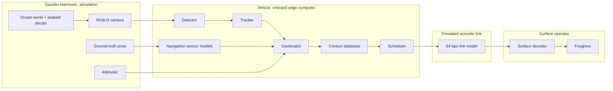

# PS11-AUV Reference Report

**Audience:** presenter explaining the project to a technically strong judge who did not write it.

**Evidence rule:** Numbers below are followed by a source in brackets. Claims about future work are labeled **PLANNED**. A number is not presented as a measured result unless it appears in a repository file or in captured terminal output.

## 1. The 60-second pitch

An autonomous underwater vehicle (AUV) surveys the seabed with a camera. Sending the camera stream to the surface is impractical over a very low-rate acoustic link, so the vehicle performs the useful interpretation at the edge: detect an object, maintain one track through repeated sightings, estimate its map position, fuse observations into a contact, and transmit only a compact prioritized report.

The telemetry prototype uses an emulated Water Linked M64 profile: 64 bits per second, 8-byte payloads, half-duplex behavior, about 500 ms latency, and an explicitly labeled 5% loss assumption [ros2_ws/src/ps11_bringup/config/link_profiles.yaml]. A contact report occupies one 8-byte frame, so its payload consumes 1 second of airtime at 64 bps [docs/implementation_plan.md, §11.3]. The repository currently proves the codec, link model, surface decoder boundary, common helpers, dataset evaluation, and a kinematic simulation scaffold. The complete perception-to-surface demo is **IN PROGRESS**: most vehicle nodes, scheduler, metrics, Foxglove layout, integration run, and Jetson benchmark remain **PLANNED** or todo in status [docs/STATUS.md].

## 2. The problem

### Why acoustic links are slow

Radio-frequency links attenuate strongly underwater, so this design represents the backhaul with a low-rate acoustic modem. The chosen representative profile provides 64 bps net throughput and is half duplex [ros2_ws/src/ps11_bringup/config/link_profiles.yaml]. The M64 product is discontinued and is being used as a representative published specification, not as proof of a current modem integration [ros2_ws/src/ps11_bringup/config/link_profiles.yaml].

### What that makes impossible

The assumed camera is 640 x 480 RGB at 10 Hz [docs/implementation_plan.md, §2 A6]. An uncompressed RGB stream would be:

```text
640 pixels x 480 pixels x 3 bytes/pixel x 8 bits/byte x 10 frames/s
= 73,728,000 bits/s
```

This arithmetic is a raw-camera upper bound, not a measured encoded stream [docs/implementation_plan.md, §2 A6]. Relative to 64 bps, the raw rate is 1,152,000 times the link rate [docs/implementation_plan.md, §2 A6; ros2_ws/src/ps11_bringup/config/link_profiles.yaml].

The plan's illustrative JPEG comparison uses a roughly 40 KB image:

```text
40,000 bytes x 8 bits/byte / 64 bits/s = 5,000 s = about 83.33 minutes
```

That is an estimate from the plan, not a run measurement [docs/implementation_plan.md, §11.3]. The live metric is intended to JPEG-encode every camera frame at quality 75, and the conservative presentation comparison is H.264 from a recorded bag; those runs are **NOT MEASURED YET** [docs/implementation_plan.md, §12.2-12.4; docs/STATUS.md, T4.5].

### The useful reframing

The surface does not need every pixel for the first operational question. It needs structured facts such as class, approximate position, depth, confidence, uncertainty, and vehicle state. A CONTACT message carries those facts in 64 bits [docs/implementation_plan.md, §11.3]. The important evaluation is therefore not just a bandwidth ratio: it is whether useful contacts arrive, how late they arrive, and how far their reported positions are from truth. Those end-to-end metrics are **NOT MEASURED YET** [docs/implementation_plan.md, §12.2; docs/STATUS.md].

## 3. Architecture



A camera frame is processed onboard; a detector proposes objects, a tracker decides whether successive boxes are the same object, and a geolocator projects the observation into the map using navigation and altitude. The contact database fuses repeated observations, then the scheduler chooses the most valuable contact or a heartbeat when the link offers a transmission slot. The emulator applies fixed airtime, latency, loss, and half-duplex behavior. Only decoded bytes reach the surface decoder, which reconstructs contacts and vehicle track for the operator. Metrics may also read simulator truth, but that is evaluation-only and must not feed the vehicle or surface path [docs/implementation_plan.md, §3, §12.1].

**Architecture status:** the diagram describes the target M1 chain. The implemented repository currently has the kinematic Gazebo launch scaffold, codec/link/surface path, and common helpers; the complete chain is not yet runnable end to end [docs/STATUS.md].

## 4. Components

### 4.1 Sim: **DONE** for the kinematic scaffold; full demo scene **IN PROGRESS**

- **Say it in 20 seconds:** Gazebo provides the underwater world, vehicle, camera/depth camera, IMU, odometry, and bridge. M1 uses kinematic velocity control rather than a dynamically modeled vehicle [docs/STATUS.md, T1.2; docs/implementation_plan.md, §7-§8].
- **What goes in / what comes out:** Gazebo publishes `/sim/gt/odom`, camera images and depth, IMU, odometry, and altimeter topics through the bridge; the intended rates are 10 Hz camera/depth, about 100 Hz IMU, and about 50 Hz ground-truth odometry [docs/implementation_plan.md, §14.1; docs/STATUS.md, T1.2].
- **How it works:** The current launch starts a kinematic simulation and bridges sensor topics. A seabed decal generator and waypoint mission are separate tasks, not claimed complete [docs/STATUS.md, T1.2, T1.4, T1.5].
- **Why this design:** Kinematic mode keeps M1 focused on perception and telemetry. A dynamic vehicle with thrusters, buoyancy, drag, hydrodynamics, and ArduSub SITL is deferred to M2 because it has substantially larger integration scope [docs/implementation_plan.md, §15.3].
- **Key parameters:** camera assumption 640 x 480 RGB at 10 Hz; M1 starting pose `(0, 0, -12.5)`; mission altitude 2.5 m; nominal survey speed 1.0 m/s [docs/implementation_plan.md, §2 A6; §15.2 T1.2; ros2_ws/src/ps11_bringup/config/mission.yaml].
- **Limitations and failure cases:** No complete generated demo/eval seabed, waypoint follower, or dynamic hydrodynamics is verified in this branch. Gazebo performance and sim-to-real appearance remain risks [docs/STATUS.md; docs/implementation_plan.md, §18].
- **If challenged:** “Is this a physically faithful AUV?” Truthful answer: no. It is currently a kinematic simulation scaffold; dynamic physics and autopilot integration are M2 work [docs/STATUS.md, T6.1-T6.7].

### 4.2 Navigation sensor models: **PLANNED**

- **Say it in 20 seconds:** Planned nodes turn privileged simulator navigation into noisy vehicle-side odometry, depth, and altitude inputs so perception cannot use truth directly [docs/implementation_plan.md, §9.2].
- **What goes in / what comes out:** `/sim/gt/odom` is consumed only by `odom_noise`; simulator depth is consumed only by `depth_sim`; the intended outputs are `/vehicle/nav/odom`, `/vehicle/depth`, and `/vehicle/altitude` [docs/implementation_plan.md, §1.4, §9.2, §14.1].
- **How it works:** The planned horizontal random walk grows at 0.5% of distance traveled; depth adds Gaussian noise with sigma 0.02 m; heading has a 0.5 degree bias [ros2_ws/src/ps11_bringup/config/nav.yaml].
- **Why this design:** It tests localization under bounded sensor imperfection without claiming a real DVL. A full DVL or sonar model is explicitly a non-goal for now [docs/implementation_plan.md, §1.3].
- **Key parameters:** `position_drift_rate: 0.005`, `heading_bias_rad: 0.00872665`, `noise_sigma_m: 0.02`, range limits 0.2 m to 50.0 m [ros2_ws/src/ps11_bringup/config/nav.yaml].
- **Limitations and failure cases:** Nodes and the required fixed-seed 100 m validation are not present in the current source inventory; performance is **NOT VERIFIED** [docs/STATUS.md, T1.3].
- **If challenged:** “Does the estimator know ground truth?” In the intended architecture, only the sensor model sees simulator truth; perception and telemetry consume the noisy vehicle topics [docs/implementation_plan.md, §1.4 H2].

### 4.3 Detector: **PLANNED** as a ROS node; offline model evaluation **DONE**

- **Say it in 20 seconds:** The planned detector runs YOLO on the vehicle camera, rate-capped to the measured edge rate, and emits object detections plus an annotated image with a simulation banner [docs/implementation_plan.md, §10.5; §1.4 H3].
- **What goes in / what comes out:** It should consume `/vehicle/camera/image_uw` and publish `/vehicle/perception/detections` and `/vehicle/perception/image_annotated` [docs/implementation_plan.md, §14.1].
- **How it works:** Offline training/evaluation uses YOLO11n at 640 x 640; the planned runtime uses confidence threshold 0.35 and intersection-over-union threshold 0.5 [ml/results/eval.md; ros2_ws/src/ps11_bringup/config/perception.yaml].
- **Why this design:** A small YOLO model is a practical detector for edge inference. The alternative of sending images to the surface defeats the low-bandwidth objective; a larger detector is not chosen because the Jetson benchmark is still pending [docs/implementation_plan.md, §10.3; docs/STATUS.md, T5.2].
- **Key parameters:** model `ml/weights/best.pt`, image size 640, confidence 0.35, intersection-over-union 0.5, capped rate 5.0 Hz; the 5.0 Hz cap is labeled an assumption pending Jetson measurement [ros2_ws/src/ps11_bringup/config/perception.yaml].
- **Limitations and failure cases:** The ROS detector node is absent; the model has weak combined TrashCan results (mAP50 0.183 on that test subset) despite stronger combined/DUO results [ml/results/eval.md]. Jetson throughput, power, and end-to-end preprocessing cost are **NOT MEASURED YET** [docs/STATUS.md, T5.1-T5.2].
- **If challenged:** “Is the detector proven on the simulated seabed?” No. Offline test-set evaluation exists, but sim-camera detector recall and the optional sim fine-tune are **NOT VERIFIED** [docs/STATUS.md, T2.5, T2.9].

### 4.4 Tracker: **PLANNED**

- **Say it in 20 seconds:** The tracker should turn noisy per-frame boxes into persistent track IDs, so one object seen repeatedly does not become many reports [docs/implementation_plan.md, §10.6].
- **What goes in / what comes out:** It should consume `/vehicle/perception/detections` and publish `/vehicle/perception/tracks` using `TrackArray` [docs/implementation_plan.md, §14.1, §14.2].
- **How it works:** The selected method is ByteTrack; a track is published only after the configured hit and confidence requirements [docs/implementation_plan.md, §10.6; ros2_ws/src/ps11_bringup/config/perception.yaml].
- **Why this design:** ByteTrack is a lightweight established tracker and keeps identity logic separate from the detector. Frame-by-frame independent reporting would inflate bandwidth and duplicate contacts [docs/implementation_plan.md, §10.6].
- **Key parameters:** `min_hits: 5`, `min_mean_conf: 0.4`, activation threshold 0.25, lost buffer 30, matching threshold 0.8 [ros2_ws/src/ps11_bringup/config/perception.yaml].
- **Limitations and failure cases:** The node and synthetic tests are not present; identity switches and occlusions are **NOT VERIFIED** [docs/STATUS.md, T2.6].
- **If challenged:** “What prevents duplicate reports?” The intended answer is persistent track IDs followed by contact fusion, but that chain is not implemented end to end yet [docs/implementation_plan.md, §10.6-§10.8; docs/STATUS.md].

### 4.5 Geolocator: **PLANNED**

- **Say it in 20 seconds:** The geolocator converts a confirmed image observation into a map position by intersecting the camera ray with the seabed using vehicle pose, camera calibration, and altitude [docs/implementation_plan.md, §10.7].
- **What goes in / what comes out:** It should consume tracks, camera info, noisy navigation, and `/vehicle/altitude`; it should publish `ObservationArray` on `/vehicle/perception/observations` [docs/implementation_plan.md, §14.1-§14.2].
- **How it works:** The planned method is ray-to-seabed projection; uncertainty combines image-pixel uncertainty and altitude uncertainty, with maximum range 12 m [docs/implementation_plan.md, §10.7; ros2_ws/src/ps11_bringup/config/perception.yaml].
- **Why this design:** It sends map-level semantics rather than pixels. A DVL/SLAM solution is not selected because sonar/DVL models and real-water validation are outside current scope [docs/implementation_plan.md, §1.3].
- **Key parameters:** `max_range_m: 12.0`, `sigma_px: 8.0`, `sigma_alt_m: 0.1` [ros2_ws/src/ps11_bringup/config/perception.yaml].
- **Limitations and failure cases:** The geometry module, node, and stationary-object validation are absent; the claimed 45 degree image-center behavior and approximately 1 m sim accuracy are **NOT VERIFIED** [docs/STATUS.md, T2.7].
- **If challenged:** “Where does position come from if the surface cannot see the vehicle?” The vehicle computes it onboard from its navigation and range inputs, then transmits the position in CONTACT; the surface never asks the simulator [docs/implementation_plan.md, §1.4 H1-H2].

### 4.6 contact_db: **PLANNED**

- **Say it in 20 seconds:** The contact database merges observations that likely refer to the same physical object and publishes one fused contact with uncertainty [docs/implementation_plan.md, §10.8].
- **What goes in / what comes out:** It should consume `/vehicle/perception/observations` and publish `/vehicle/contacts` and `/vehicle/markers` [docs/implementation_plan.md, §14.1].
- **How it works:** Observations within the configured spatial gate are fused; uncertainty shrinks with evidence but not below a floor [docs/implementation_plan.md, §10.8].
- **Why this design:** Fusion avoids sending every sighting. The alternative FIFO observation policy is retained only as a planned baseline because it demonstrates queue growth without edge filtering [docs/implementation_plan.md, §11.7].
- **Key parameters:** gate 2.0 m, uncertainty floor 0.3 m, publish rate 2.0 Hz [ros2_ws/src/ps11_bringup/config/perception.yaml].
- **Limitations and failure cases:** No fusion logic or node is present; duplicate merging, false merges, and uncertainty calibration are **NOT VERIFIED** [docs/STATUS.md, T2.8].
- **If challenged:** “Could two nearby objects be merged?” Yes, that is a real failure mode of a gated fusion scheme; the 2.0 m gate is a configured design choice, not a demonstrated accuracy guarantee [ros2_ws/src/ps11_bringup/config/perception.yaml].

### 4.7 Scheduler: **PLANNED**

- **Say it in 20 seconds:** The scheduler spends scarce transmission slots on new and important contacts, sends meaningful updates, and periodically keeps the surface informed with a heartbeat [docs/implementation_plan.md, §11.7].
- **What goes in / what comes out:** Inputs are `/vehicle/contacts`, `/vehicle/nav/odom`, `/vehicle/mission/state`, and `/link/tx_ready`; output is `/link/tx` containing `LinkFrame` [docs/implementation_plan.md, §11.7, §14.1].
- **How it works:** On each available slot, it sends an overdue heartbeat, then ranks candidates by class priority, confidence, novelty, and age. Updates require sufficient motion, improved sigma, or a class change [docs/implementation_plan.md, §11.7].
- **Why this design:** Semantic prioritization preserves useful information under congestion. FIFO observations are the planned baseline, but it sends duplicates and allows its queue/delay to grow [docs/implementation_plan.md, §11.7].
- **Key parameters:** heartbeat max/min periods 15.0/5.0 s; minimum movement 1.0 m; sigma ratio 0.5; update novelty 0.3; age time constant 30.0 s; age cap 60.0 s [ros2_ws/src/ps11_bringup/config/scheduler.yaml].
- **Limitations and failure cases:** No policy or node exists yet. Priority behavior, heartbeat timing, and queue outcomes are **NOT VERIFIED** [docs/STATUS.md, T3.3].
- **If challenged:** “Is the 64 bps link enough for everything?” No; the scheduler explicitly chooses what to report and may leave information pending. The pending count is itself bounded to 63 in the heartbeat format [ros2_ws/src/ps11_telemetry/ps11_telemetry/codec.py].

### 4.8 Codec: **DONE**

- **Say it in 20 seconds:** The codec packs a heartbeat or contact report into exactly 8 bytes and reverses it without ROS dependencies [ros2_ws/src/ps11_telemetry/ps11_telemetry/codec.py].
- **What goes in / what comes out:** `encode(Heartbeat | ContactReport)` returns 8 bytes; `decode(bytes)` returns the message or `None` for padding/unknown extended messages. `pack_frame` and `unpack_frame` support fixed-size frames [ros2_ws/src/ps11_telemetry/ps11_telemetry/codec.py].
- **How it works:** It builds one 64-bit integer most-significant-bit first. Physical fields are quantized and clamped with warnings; identifiers are range-checked; time is modulo 2048 s; sigma is bucketed [ros2_ws/src/ps11_telemetry/ps11_telemetry/codec.py].
- **Why this design:** Fixed-size bit packing makes airtime predictable. Sending JSON or a variable-length image would add overhead and undermine deterministic scheduling; a future `EXTENDED` type is reserved rather than guessed now [docs/implementation_plan.md, §11.4].
- **Key parameters:** coordinates use 0.5 m steps and signed 12-bit fields; depth uses 0.5 m steps; CONTACT confidence is `round(confidence x 7)` and decoded as `q/7`; CONTACT time is 11 bits modulo 2048; flags are 2 bits [docs/implementation_plan.md, §11.3].
- **Limitations and failure cases:** Quantization, coordinate range, modulo time ambiguity after 2048 s, and the 8-class limit are intentional constraints. The codec does not provide encryption, authentication, retransmission, or semantic correctness checking [docs/implementation_plan.md, §11.3-§11.4].
- **If challenged:** “Can it silently change layout?” The frozen golden-vector file and tests are intended to prevent that; the focused run in this report passed 19 tests [ros2_ws/src/ps11_telemetry/test/golden_vectors.json; command output in §5].

### 4.9 Link emulator: **DONE**

- **Say it in 20 seconds:** The link model makes a normal ROS message experience the time and loss of a slow acoustic channel [ros2_ws/src/ps11_telemetry/ps11_telemetry/link_model.py].
- **What goes in / what comes out:** The node consumes `/link/tx` and publishes `/link/rx`, `/link/tx_ready`, and `/link/stats` [docs/implementation_plan.md, §11.6, §14.1].
- **How it works:** Airtime is `frame_payload_bytes x 8 / bitrate_bps`; frames sent while busy queue in queue mode, pull mode emits readiness while idle, latency is added after airtime, and a seeded random draw applies loss [ros2_ws/src/ps11_telemetry/ps11_telemetry/link_model.py]. All-zero payloads are discarded at reception as sync padding [ros2_ws/src/ps11_telemetry/ps11_telemetry/link_model.py].
- **Why this design:** A pure Python model is deterministic and unit-testable, while the ROS node stays thin. It is preferable to pretending a laptop socket measures an underwater channel; it is still only an emulator, not a modem driver [docs/implementation_plan.md, §11.6].
- **Key parameters:** 64 bps, 8-byte frame, 0.5 s latency, 0.05 loss probability assumption, half duplex, seed 42 default [ros2_ws/src/ps11_bringup/config/link_profiles.yaml; ros2_ws/src/ps11_telemetry/ps11_telemetry/link_model.py].
- **Limitations and failure cases:** The loss model is independent random loss, not burst loss; queue is unbounded; there are no acknowledgements or retransmissions; those are M3 plans [docs/implementation_plan.md, §15.4].
- **If challenged:** “What happens at 5% packet loss?” In the current model each frame is independently lost with configured probability 0.05; exact end-to-end contact recall under that loss is **NOT MEASURED YET** [ros2_ws/src/ps11_bringup/config/link_profiles.yaml; docs/STATUS.md, T4.2].

### 4.10 Surface decoder: **DONE**

- **Say it in 20 seconds:** The surface decoder reconstructs only what arrives in `/link/rx`, maintaining the latest contact per ID and a vehicle path from decoded heartbeats [ros2_ws/src/ps11_telemetry/ps11_telemetry/surface_decoder_node.py; docs/STATUS.md, T3.4].
- **What goes in / what comes out:** It subscribes to `/link/rx`; it publishes `/surface/contacts` (`ContactArray`), `/surface/vehicle_track` (`nav_msgs/Path`), and `/surface/markers` (`MarkerArray`) [ros2_ws/src/ps11_telemetry/ps11_telemetry/surface_decoder_node.py].
- **How it works:** It decodes each payload, unwraps modulo-2048 mission time using the shared `mission_start_s`, updates contact state, and publishes map-frame points with uncertainty markers [ros2_ws/src/ps11_telemetry/ps11_telemetry/surface_state.py].
- **Why this design:** The strict one-input boundary makes the surface a genuine receiver rather than a hidden consumer of truth. A surface node reading vehicle odometry or simulator state would invalidate the demonstration [docs/implementation_plan.md, §1.4 H1].
- **Key parameters:** `mission_start_s: 0.0` and `frame_id: map` defaults [ros2_ws/src/ps11_telemetry/ps11_telemetry/surface_decoder_node.py].
- **Limitations and failure cases:** Latest-report-wins state does not reconstruct lost history; unknown extended messages are skipped; no acknowledgements or retransmission exist [ros2_ws/src/ps11_telemetry/ps11_telemetry/surface_state.py; docs/implementation_plan.md, §11.4].
- **If challenged:** “How do you know this node is not cheating?” Its test inspects subscriptions and requires `/link/rx`; the implementation creates no vehicle or simulator subscription [ros2_ws/src/ps11_telemetry/test/test_surface_decoder.py].

### 4.11 Metrics: **PLANNED**

- **Say it in 20 seconds:** Metrics compare what the vehicle found with what crossed the link, while keeping ground truth in the evaluation namespace [docs/implementation_plan.md, §12.1].
- **What goes in / what comes out:** Planned inputs include `/sim/gt/odom`, world objects, camera frames, onboard contacts, surface contacts, and `/link/stats`; output is `/eval/counters` and a shutdown `summary.json`/`timeseries.csv` [docs/implementation_plan.md, §12.1].
- **How it works:** It will count semantic transmitted bits, live JPEG-equivalent bits, surface recall, matched position error, first-report latency, and bits per delivered contact [docs/implementation_plan.md, §12.2].
- **Why this design:** Evaluation can see truth without leaking it into operations. A bandwidth-only chart would be weak because the link-rate ratio is largely arithmetic; recall, latency, and position error test usefulness [docs/implementation_plan.md, §12.2].
- **Key parameters:** JPEG quality 75 for the live comparison; a contact is reported when its surface position is within 3 m of the matching ground-truth object; exact run parameters are not yet recorded [docs/implementation_plan.md, §12.2].
- **Limitations and failure cases:** No metrics node or `summary.json` run is present. All end-to-end metrics, H.264 comparison, and charts are **NOT MEASURED YET** [docs/STATUS.md, T4.2, T4.5].
- **If challenged:** “Could metrics accidentally make the operator look better?” The design puts truth in `/eval/*`, labels ground-truth markers evaluation-only, and requires the surface path to remain link-only [docs/implementation_plan.md, §1.4 H1-H2; §13]. The automated full graph check is still **NOT VERIFIED**.

### 4.12 Foxglove: **PLANNED**

- **Say it in 20 seconds:** Foxglove is the intended operator view: onboard simulation on the left, decoded surface state on the right, and bandwidth counters below [docs/implementation_plan.md, §13].
- **What goes in / what comes out:** It will display annotated camera data, vehicle markers, `/surface/markers`, `/surface/vehicle_track`, `/surface/contacts`, `/eval/counters`, and `/link/stats`; it is a visualization client rather than a producer [docs/implementation_plan.md, §13].
- **How it works:** The planned layout connects through `foxglove_bridge` at `ws://localhost:8765`, with ground truth hidden by default [docs/implementation_plan.md, §13].
- **Why this design:** A split operator view makes the distinction between onboard knowledge and received knowledge visible. RViz remains a debugging tool; the pitch layout is planned for Foxglove [docs/implementation_plan.md, §4, §13].
- **Key parameters:** bridge endpoint `ws://localhost:8765`; titles must identify vehicle simulation and received 64 bps surface state [docs/implementation_plan.md, §13].
- **Limitations and failure cases:** No layout file is present in the current tree and no populated-panel acceptance run is recorded [docs/STATUS.md, T4.3].
- **If challenged:** “Is the surface map secretly ground truth?” The intended layout must show only `/surface/*` data on the surface panel; any ground-truth markers are evaluation-only and labeled [docs/implementation_plan.md, §13].

## 5. The 8-byte message

### 5.1 HEARTBEAT layout

The type prefix is the two most significant bits. Field order below is the actual codec order, totaling 64 bits [ros2_ws/src/ps11_telemetry/ps11_telemetry/codec.py; docs/implementation_plan.md, §11.2].

| Field | Bits | Encoding |
|---|---:|---|
| type | 2 | `01` |
| t | 11 | seconds modulo 2048 |
| x | 12 | signed, 0.5 m/step |
| y | 12 | signed, 0.5 m/step |
| depth | 8 | unsigned, 0.5 m/step |
| heading | 6 | 5.625 degrees/step |
| battery | 4 | fraction quantized to 0-15 |
| state | 3 | 0-7 |
| pending | 6 | saturates at 63 |
| **Total** | **64** | |

### 5.2 CONTACT layout

| Field | Bits | Encoding |
|---|---:|---|
| type | 2 | `10` |
| contact_id | 8 | 0-255, rejected outside range |
| class_id | 3 | 0-7, from `classes.yaml` |
| confidence | 3 | `round(confidence x 7)`, decode `q/7` |
| x | 12 | signed, 0.5 m/step |
| y | 12 | signed, 0.5 m/step |
| depth | 8 | unsigned, 0.5 m/step |
| sigma | 3 | bucket upper bound: 0.25, 0.5, 1, 2, 4, 8, 16, or 32 m |
| t | 11 | seconds modulo 2048 |
| flags | 2 | bit 1 update; bit 0 reserved zero |
| **Total** | **64** | |

### 5.3 Worked real contact

This uses the reference contact represented in the actual codec test: contact ID 5, class ID 0, confidence `6/7`, position `(12.5, -3.0)` m, depth 15.0 m, sigma 1.0 m, time 100 s, first report [ros2_ws/src/ps11_telemetry/test/test_codec.py]. The exact command and output captured from this branch were:

```text
input: ContactReport(contact_id=5, class_id=0, confidence=0.8571428571428571, x_m=12.5, y_m=-3.0, depth_m=15.0, sigma_m=1.0, t_s=100, is_update=False)
hex: 8146019ffa1e4190
decoded: ContactReport(contact_id=5, class_id=0, confidence=0.8571428571428571, x_m=12.5, y_m=-3.0, depth_m=15.0, sigma_m=1.0, t_s=100, is_update=False)
bits: 1000000101000110000000011001111111111010000111100100000110010000
```

Source command: `PYTHONPATH=ros2_ws/src/ps11_telemetry python - <<'PY' ... encode(ContactReport(...)) ... PY` [command run for this report].

Field decoding from the bit string:

| Field | Encoded value | Decoded meaning |
|---|---:|---|
| type | `10` | CONTACT |
| contact_id | `00000101` = 5 | contact 5 |
| class_id | `000` = 0 | debris, from `classes.yaml` |
| confidence | `110` = 6 | `6/7 = 0.8571428571428571` |
| x | `000000011001` = 25 | 25 half-meter steps = 12.5 m east |
| y | `111111110100` | signed -6 steps = -3.0 m north |
| depth | `00011110` = 30 | 30 half-meter steps = 15.0 m |
| sigma | `010` = 2 | bucket upper bound 1.0 m |
| t | `00001100100` = 100 | 100 s modulo 2048 |
| flags | `00` | first report, not update |

The hexadecimal payload is therefore 8 bytes, and the decoder returns the same quantized values. This proves codec round-trip behavior for this vector, not complete system accuracy.

## 6. Honesty rules H1-H7

| Rule | Meaning | Enforcement in code/config | Proof status |
|---|---|---|---|
| H1 | Surface sees only what crossed `/link/rx`. | `SurfaceDecoderNode` creates only the `/link/rx` subscription; the test inspects subscriptions. | **DONE:** focused surface test passed as part of 19 passed [ros2_ws/src/ps11_telemetry/test/test_surface_decoder.py; command output in §5]. |
| H2 | Simulator truth stays in evaluation and permitted sensor models. | Namespace contract and planned graph restrict `/sim/*` to `odom_noise`, `depth_sim`, and `metrics`. | **NOT FULLY VERIFIED:** current vehicle nodes/metrics are not all implemented [docs/implementation_plan.md, §1.4; docs/STATUS.md]. |
| H3 | The operator is told that the camera/detector/navigation context is simulated and the detector rate is capped. | Planned annotated-image banner and `max_rate_hz` assumption in perception config. | **PLANNED:** detector node and banner acceptance are todo [ros2_ws/src/ps11_bringup/config/perception.yaml; docs/STATUS.md, T2.5]. |
| H4 | Seabed decals come only from test-split images, never training images. | Planned generator must refuse images absent from `ml/data/test_manifest.txt`; dataset report records split integrity. | **PARTIAL:** dataset split report exists; generator and guard test are todo [ml/results/eval.md; docs/STATUS.md, T1.4]. |
| H5 | Bandwidth ratios shown are computed from actual runs, and the slide uses H.264 rather than raw-frame/JPEG optimism. | Planned metrics encode frames live; planned `video_equiv.py` re-encodes recorded video with libx264. | **NOT VERIFIED:** no run summary or H.264 chart exists [docs/implementation_plan.md, §12.2-§12.3; docs/STATUS.md, T4.2, T4.5]. |
| H6 | Jetson figures come only from recorded Jetson runs. | Benchmark deliverable requires raw logs and a traceable benchmark report; current detector config labels 5 Hz as pending. | **NOT MEASURED YET:** Jetson tasks are todo and `jetson/results/` contains only `.gitkeep` [docs/STATUS.md, T5.1-T5.2]. |
| H7 | Link assumptions are labeled. | `loss_prob: 0.05` is marked `ASSUMPTION`; profile says M64 is discontinued and representative. | **DONE in config:** labeling is present; an end-to-end presentation run is not verified [ros2_ws/src/ps11_bringup/config/link_profiles.yaml]. |

## 7. Simulated versus real, and TRL framing

**Simulated:** Gazebo vehicle motion in the current M1 scaffold, camera/depth/odometry streams, navigation noise model when implemented, seabed scene, acoustic timing/loss, surface delivery, and metrics truth source [docs/implementation_plan.md, §3, §9, §11.6, §12.1]. The detector model is trained/evaluated on real underwater datasets, but its simulated-camera integration is not complete [ml/results/eval.md; docs/STATUS.md].

**Real or externally grounded:** the detector training/test images are from TrashCan and DUO test/train procedures recorded by the repository; the M64 payload/rate is based on a published representative specification; the Jetson target is an Orin Nano developer kit, but its benchmark is not yet recorded [ml/results/eval.md; ros2_ws/src/ps11_bringup/config/link_profiles.yaml; docs/implementation_plan.md, §2 A7; docs/STATUS.md, T5.1-T5.2].

**Not real yet:** no in-water acoustic modem, no real vehicle mission, no Jetson-in-the-loop ROS pipeline, no dynamic hydrodynamics, no sonar/DVL, no field detection validation, and no production security/encryption [docs/implementation_plan.md, §1.3, §15.3].

**TRL 3-4 framing:** the README labels the project simulation stage TRL 3-4 [README.md]. That is honest: there is a working bench-level codec/link/surface prototype and offline detector evaluation, but not a validated relevant-environment system or field demonstration. The current branch does not justify a higher readiness claim.

## 8. Measured results

Only values with repository or command evidence are listed as results.

| Result | Value | Source and interpretation |
|---|---:|---|
| Codec/link/surface focused tests | `19 passed in 0.05s` | Exact terminal output from `python -m pytest ... -q` run for this report. This is a test result, not an end-to-end demo result. |
| Detector combined test mAP50 | `0.703` | `ml/results/eval.md`; offline test split, 2,229 images. |
| Detector combined test mAP50-95 | `0.533` | `ml/results/eval.md`; offline test split. |
| Detector TrashCan-only test mAP50 | `0.183` | `ml/results/eval.md`; real-world debris benchmark subset. |
| Detector DUO-only test mAP50 | `0.835` | `ml/results/eval.md`; marine-life benchmark subset. |
| Laptop detector inference | `1.7 ms inference`, `406.7 FPS total pipeline` | `ml/results/eval.md`; RTX 5060 Laptop GPU, not Jetson. |
| CONTACT worked example | hex `8146019ffa1e4190` | Actual codec command output in §5.3. |
| Jetson throughput, latency, power | **NOT MEASURED YET** | `jetson/results/` has no benchmark log; T5.1/T5.2 are todo [docs/STATUS.md]. |
| End-to-end semantic bits, JPEG/H.264 ratio | **NOT MEASURED YET** | No metrics run or `summary.json`; T4.2/T4.5 are todo [docs/STATUS.md]. |
| Surface recall, position error, first-report latency | **NOT MEASURED YET** | No integration run; T4.2/T4.4 are todo [docs/STATUS.md]. |
| Packet-loss contact recall at 5% | **NOT MEASURED YET** | Link loss is configured as an assumption, but no end-to-end recall run exists [ros2_ws/src/ps11_bringup/config/link_profiles.yaml]. |

## 9. Defence Q&A

1. **Isn't the bandwidth ratio trivial?** Partly. Any 64 bps link makes a fast video stream look impossible. The nontrivial claims are whether useful contacts arrive, with what latency and position error; those are the metrics still to run [docs/implementation_plan.md, §12.2].
2. **Why not compress video more?** Compression reduces the source rate but does not remove the severe mismatch; the comparison should use measured H.264, not a favorable raw-frame or JPEG-only claim. H.264 evidence is **NOT MEASURED YET** [docs/implementation_plan.md, §12.3].
3. **What if the detector is wrong?** A false detection can become a bad contact; repeated tracking and contact fusion reduce duplicate noise but do not prove correctness. Detector quality varies sharply by dataset, including TrashCan-only mAP50 0.183 [ml/results/eval.md].
4. **How does the surface know positions without seeing the sim?** The vehicle computes map positions onboard and transmits them in CONTACT. The surface consumes `/link/rx` only [docs/implementation_plan.md, §1.4 H1-H2].
5. **What happens at 5% packet loss?** The emulator independently drops each frame with configured probability 0.05, with no current retransmission. End-to-end recall under that condition is **NOT MEASURED YET** [ros2_ws/src/ps11_telemetry/ps11_telemetry/link_model.py; ros2_ws/src/ps11_bringup/config/link_profiles.yaml].
6. **Why 0.5 m resolution?** It is the chosen coordinate quantization that fits the 12-bit signed x/y fields in 64 bits; it is not a claim that the whole geolocation pipeline is accurate to 0.5 m [docs/implementation_plan.md, §11.2-§11.3].
7. **What did you build versus reuse?** The repository implements the Python codec, link model/node, surface decoder/state, common helpers, ROS interfaces, launch/config scaffolding, and ML scripts/results. It plans to reuse YOLO11n and ByteTrack; exact end-to-end integration is unfinished [docs/STATUS.md; ros2_ws/src/ps11_telemetry].
8. **Why is this only TRL 3-4?** It is simulation-stage bench evidence, not a relevant-environment or field demonstration. Jetson, dynamic vehicle, acoustic hardware, and in-water tests are absent [README.md; docs/implementation_plan.md, §1.3, §15.3].
9. **Can the codec report any class?** It supports 3 class bits, so 8 IDs; IDs 4-7 are reserved in the current classes file [ros2_ws/src/ps11_bringup/config/classes.yaml].
10. **Can an identifier be silently clamped?** No. Out-of-range contact ID, class ID, or state raises `ValueError`; physical quantities clamp with warnings [ros2_ws/src/ps11_telemetry/ps11_telemetry/codec.py].
11. **What is the cost of one contact?** One 8-byte payload is 64 bits and therefore 1 second of payload airtime at 64 bps [docs/implementation_plan.md, §11.3; ros2_ws/src/ps11_bringup/config/link_profiles.yaml].
12. **Why send heartbeats?** They give the surface sparse vehicle state and a track even when no contact update is selected; the planned maximum interval is 15.0 s [docs/implementation_plan.md, §11.7; ros2_ws/src/ps11_bringup/config/scheduler.yaml].
13. **What if a contact moves?** The planned scheduler sends an update after at least 1.0 m movement, a sufficiently improved uncertainty, or class change, subject to priority and available slots [docs/implementation_plan.md, §11.7; ros2_ws/src/ps11_bringup/config/scheduler.yaml].
14. **Does the surface retain every observation?** No. The current surface state keeps the latest report per contact ID and increments sightings; lost frames and older positions are not reconstructed [ros2_ws/src/ps11_telemetry/ps11_telemetry/surface_state.py].
15. **What does half duplex change?** The emulator makes the transmitter busy for the full padded frame airtime; it does not model simultaneous transmit and receive [ros2_ws/src/ps11_telemetry/ps11_telemetry/link_model.py].
16. **Are the loss numbers from a datasheet?** No. The 0.05 loss probability is explicitly labeled an assumption in configuration, not a modem measurement [ros2_ws/src/ps11_bringup/config/link_profiles.yaml].
17. **Why not use ground truth to get perfect positions?** That would invalidate the claim. The honesty contract permits simulator truth only in sensor-model nodes and metrics; the planned graph keeps it out of perception and telemetry [docs/implementation_plan.md, §1.4 H2].
18. **Are the seabed images training images?** The rule requires test-split images only for decals. The evaluation report documents that intent, but the generator guard is not implemented yet [ml/results/eval.md; docs/STATUS.md, T1.4].
19. **What is the detector's strongest evidence?** Offline test evaluation: combined mAP50 0.703, with DUO-only mAP50 0.835 and TrashCan-only mAP50 0.183 [ml/results/eval.md]. It is not evidence of Jetson or sim performance.
20. **Why cap the detector at 5 Hz?** The config uses 5.0 Hz as a temporary assumption for the expected reliable runtime rate; it must be replaced or confirmed by a recorded Jetson run [ros2_ws/src/ps11_bringup/config/perception.yaml; docs/STATUS.md, T5.2].
21. **What happens when more contacts wait than fit?** The scheduler leaves them pending and prioritizes candidates; heartbeat pending saturates at 63 [docs/implementation_plan.md, §11.7; ros2_ws/src/ps11_telemetry/ps11_telemetry/codec.py].
22. **Is the link model a real modem driver?** No. It is a deterministic channel emulator with configured bitrate, airtime, latency, loss, and queue behavior [ros2_ws/src/ps11_telemetry/ps11_telemetry/link_model.py].
23. **Why is EXTENDED reserved?** It leaves room for M3 thumbnails and uplink commands without changing the base 64-bit framing; current decoders skip unknown extended messages [docs/implementation_plan.md, §11.4].
24. **Can the system recover from a lost CONTACT?** Not currently through retransmission. The planned M3 burst-loss/acknowledgement feature is not implemented [docs/implementation_plan.md, §15.4].
25. **What is the biggest technical risk?** Sim-to-real detector performance is explicitly rated high likelihood/high impact, and the current TrashCan-only result shows why detector validation matters [docs/implementation_plan.md, §18.1; ml/results/eval.md].

## 10. Glossary

- **Airtime:** time a frame occupies the channel; here it is payload bits divided by bitrate [docs/implementation_plan.md, Appendix B].
- **AUV:** autonomous underwater vehicle.
- **ByteTrack:** the planned multi-object tracker used to maintain identities across frames [docs/implementation_plan.md, §10.6].
- **Contact:** a fused, geolocated object estimate built from observations [docs/implementation_plan.md, Appendix B].
- **EXTENDED:** reserved message type for future thumbnails and uplink commands [docs/implementation_plan.md, §11.4].
- **Foxglove:** planned operator visualization client connected through `foxglove_bridge` [docs/implementation_plan.md, §13].
- **Heartbeat:** periodic compact vehicle-state message [docs/implementation_plan.md, Appendix B].
- **H.264:** a video coding standard used for the planned conservative comparison.
- **mAP50:** mean average precision measured at intersection-over-union threshold 0.50; the report's offline detector metric [ml/results/eval.md].
- **Observation:** one geolocated sighting of a confirmed track [docs/implementation_plan.md, Appendix B].
- **ROS 2:** Robot Operating System 2, the message and node framework used by the system.
- **SITL:** software in the loop; the real autopilot code running against a simulator, planned for M2 [docs/implementation_plan.md, Appendix B].
- **Telemetry:** compact data sent over the acoustic link.
- **TRL:** technology readiness level; this project describes itself as simulation-stage TRL 3-4 [README.md].

## 11. Numbers to remember

| Number | Meaning | Source |
|---:|---|---|
| 64 bps | Representative acoustic link rate | `ros2_ws/src/ps11_bringup/config/link_profiles.yaml` |
| 8 bytes / 64 bits | Payload per M64 frame and base message size | `ros2_ws/src/ps11_bringup/config/link_profiles.yaml`; `docs/implementation_plan.md`, §11.3 |
| 1 s | Airtime for one 8-byte frame at 64 bps | `docs/implementation_plan.md`, §11.3 |
| 0.5 s | Configured propagation latency | `ros2_ws/src/ps11_bringup/config/link_profiles.yaml` |
| 5% | Independent loss assumption, not measured modem behavior | `ros2_ws/src/ps11_bringup/config/link_profiles.yaml` |
| 0.5 m | x/y/depth quantization step | `ros2_ws/src/ps11_telemetry/ps11_telemetry/codec.py` |
| 2048 s | Timestamp modulus | `ros2_ws/src/ps11_telemetry/ps11_telemetry/codec.py` |
| 15.0 s / 5.0 s | Planned heartbeat maximum/minimum periods | `ros2_ws/src/ps11_bringup/config/scheduler.yaml` |
| 2.0 m | Planned contact fusion gate | `ros2_ws/src/ps11_bringup/config/perception.yaml` |
| 0.3 m | Planned contact uncertainty floor | `ros2_ws/src/ps11_bringup/config/perception.yaml` |
| 5.0 Hz | Temporary detector-rate assumption pending Jetson benchmark | `ros2_ws/src/ps11_bringup/config/perception.yaml` |
| 0.703 | Offline combined test mAP50 | `ml/results/eval.md` |
| 0.183 | Offline TrashCan-only test mAP50 | `ml/results/eval.md` |
| 19 passed | Focused codec/link/surface-state test run in this report | Exact terminal output in §8 |
| 1.7 ms / 406.7 FPS | Laptop detector result, not Jetson | `ml/results/eval.md` |
| NOT MEASURED YET | Jetson, end-to-end recall/latency/position error, H.264 ratio, and full demo counters | `docs/STATUS.md` |

## 12. Change log

One line per existing task ID, based on `docs/CHANGELOG.md` and `docs/STATUS.md`:

- **T0.1:** Repository scaffold, package layout, LFS setup, and status tracking recorded; DONE [docs/CHANGELOG.md; docs/STATUS.md].
- **T0.2:** Laptop environment and environment checks recorded as PASS; DONE [docs/STATUS.md].
- **T0.3:** Interfaces, common helpers, and configuration YAMLs recorded; DONE [docs/STATUS.md].
- **T1.0:** SolidWorks export committed; DONE [docs/STATUS.md].
- **T1.1:** CAD export converted to ROS 2 description; DONE [docs/STATUS.md].
- **T1.2:** Kinematic Gazebo world, sensors, bridge, and dGPU verification recorded; DONE [docs/STATUS.md].
- **T2.1:** TrashCan/DUO preparation and test manifest recorded; DONE [docs/STATUS.md].
- **T2.2:** Detector training recorded as 129 epochs in 2.15 h, with best checkpoint at epoch 109; DONE [docs/STATUS.md].
- **T2.3:** Test evaluation and ONNX export recorded; DONE [docs/STATUS.md; ml/results/eval.md].
- **T3.1:** 8-byte codec, golden vectors, identifier validation, and quantization rules recorded; DONE [docs/CHANGELOG.md; docs/STATUS.md].
- **T3.2:** Link model/node, timing/loss/queue/pull behavior, and tests recorded; DONE [docs/CHANGELOG.md; docs/STATUS.md].
- **T3.4:** Surface decoder, H1 boundary, and shared mission start parameter recorded; DONE [docs/CHANGELOG.md; docs/STATUS.md].
- **Reference_report:** Living explainer created from the plan, status, changelog, source, tests, and recorded results on 2026-09-28; this task has no assigned task ID [command date supplied in task context].

## 13. Status and open questions

### Components marked PLANNED

Navigation sensor models; seabed decal generator; waypoint follower; detector ROS node; tracker; geolocator; contact database; scheduler; metrics; Foxglove layout; bringup; integration/tuning; experiments/charts; demo recording; deck/rehearsal; Jetson reflash and benchmark; all M2 dynamic vehicle/Jetson-in-loop work; all M3 mission/link features [docs/STATUS.md].

### Components marked IN PROGRESS

The overall end-to-end M1 system; the full simulated survey scene and perception-to-surface chain; H2-H6 automated/runtime evidence; H4 enforcement beyond the documented dataset split; detector validation on simulated frames [docs/STATUS.md; docs/implementation_plan.md].

### Questions the repository cannot answer yet

- What are the measured Jetson Orin Nano throughput, p99 latency, power, memory, and detector rate?
- What is the measured end-to-end surface recall, first-report latency, position error, and bits per delivered contact?
- What is the conservative H.264 ratio from a recorded run?
- Does the detector meet the intended sim scenario recall, and is sim fine-tuning needed?
- What does the full graph look like under the H2 subscription audit?
- What are the results across the planned semantic, FIFO, and generic 1 kbps experiments?
- Does the generated seabed guard reject non-test images in a real unit test?
- Can the complete demo run three times without a crash?
- What exact current modem, if any, will replace the representative discontinued M64 profile?
- Which assumptions change after dynamic vehicle and real Jetson integration?

This report must be updated at the end of each future task with the relevant component status, evidence, and one change-log line. Unmeasured values remain **NOT MEASURED YET** until a command or committed result file proves them.
