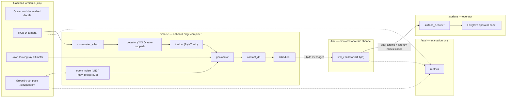

# PS11 — Semantic Telemetry AUV: Implementation Plan

**Project:** NewtonBotics · BDTS 2027 NextGen Challenge · PS11 — Edge Computing for Sensors: Reducing Bandwidth for Backhaul
**Version:** 1.0 · 26 Sep 2026
**Team:** 1 developer, Shubham (all code, with the ZCode agent) · 2 teammates (vehicle CAD, dataset downloads, Jetson, deck)
**Audience:** the two developers and their coding agents. Agents must read `AGENTS.md` first, then the section for the task they are assigned.

---

## 0. How to use this document

- **Humans:** read §1, §2, §15 (schedule), §17 (demo runbook), and §18 (risks and cut list). Do the manual tasks marked **[HUMAN]** yourself.
- **Agents:** you get one task ID at a time (for example `T3.1`). Read the task card in §15, every section it references, and the interface reference in §14. Do not start a task whose dependencies are not marked done in `docs/STATUS.md`.
- **Source of truth:** if code and this plan disagree, the plan wins until a human updates it. Interface changes (topics, messages, bit layouts, parameter names) require a plan edit in the same commit.
- **Status tracking:** keep `docs/STATUS.md` as a table: task ID | owner | status (todo / in progress / done / blocked) | notes.

---

## 1. Goal, scope and honesty rules

### 1.1 Goal

Demonstrate in simulation an AUV edge-intelligence pipeline that:

1. detects objects in the vehicle's camera stream on the vehicle,
2. turns repeated detections into a small set of geolocated **contacts**,
3. decides which contact information is worth sending, and
4. delivers it as bit-packed 8-byte messages over an **emulated 64 bps acoustic link** (Water Linked M64 spec),

and **measure** how much bandwidth this saves compared with sending video, and how much useful information still reaches the surface operator.

### 1.2 Milestones

| Milestone | When | Outcome |
|---|---|---|
| **M1 — Pitch demo** | Days 1–4 | Live split-screen demo: simulated vehicle survey → onboard detection → contacts over a 64 bps emulated link → operator map, with live bit counters. Recorded backup. Jetson inference benchmark and video. |
| **M2 — Dynamic vehicle and Jetson-in-the-loop** | Post-pitch, weeks 1–2 | Thruster-driven vehicle with buoyancy and drag, ArduSub SITL with a custom frame doing waypoint missions, perception running on the Jetson. |
| **M3 — Mission intelligence and link features** | Weeks 3–4 | Behaviour tree (re-inspection), operator uplink commands, thumbnail tier, burst-loss channel with acknowledgements, hydrodynamic tuning, licence migration study. |

### 1.3 Non-goals (for now)

Sonar or DVL sensor models, real in-water tests, multiple vehicles, uplink in M1, hydrodynamic accuracy in M1, production security or encryption.

### 1.4 Honesty rules (enforced in code and review)

These rules protect the credibility of the pitch. Violating one is a blocking bug.

- **H1 — The surface only sees what crossed the link.** Nodes under `/surface/*` may only consume `/link/rx`. They may never subscribe to `/vehicle/*`, `/sim/*` or `/eval/*`.
- **H2 — Ground truth stays in evaluation.** Simulator truth (`/sim/*`) may only be consumed by sensor-model nodes (`odom_noise`, `depth_sim`) and by `metrics`. Perception and telemetry nodes never read it.
- **H3 — Say what is simulated.** The annotated camera image and the Foxglove layout show a banner: `SIMULATION · NAV: <mode> · detector rate capped to Jetson-measured rate`.
- **H4 — No test leakage.** Images pasted into the simulated seabed come only from dataset **test** splits, which are never used for training.
- **H5 — Measured, not assumed.** Every bandwidth ratio shown is computed from the actual run. The slide uses the conservative comparison against H.264 video (§12.3), not raw frames.
- **H6 — Jetson numbers only from recorded runs.** Any Jetson figure must come from `jetson/results/` with the log file that produced it.
- **H7 — Label every link assumption.** Each link profile states its source; assumptions such as the 5% loss rate are labelled `ASSUMPTION` in the config and on screen.

---

## 2. Assumptions and open items

| # | Item | Assumption used by this plan | Confirm by |
|---|---|---|---|
| A1 | Coding agent | ZCode (Z.ai) with GLM-5.3. ZCode reads `AGENTS.md` from the project root. Do **not** run `/init` after `AGENTS.md` exists, or it may be overwritten; if you run it, merge its output into the existing file. Run one task per ZCode Goal. | Done |
| A2 | Pitch date | Pitch in 4 days; M1 must be done by the end of Day 4. | Human |
| A3 | Thruster layout | Custom industrial frame, N vectored ~60 W thrusters, fully actuated in 6 DOF. N and poses come from the CAD export. | T1.0 |
| A4 | M64 frame size | 8-byte payload per acoustic packet. **Verify against the Water Linked M64 protocol specification.** If different, change only `link_profiles.yaml` and frame packing (§11.1). | T3.2 |
| A5 | Link loss | 5% random frame loss (not in the datasheet; labelled ASSUMPTION). | Accepted for M1 |
| A6 | Camera | 640×480 RGB at 10 Hz, 90° horizontal FOV, pitched 45° down, unless the CAD defines otherwise. | T1.0 |
| A7 | Jetson | Orin Nano 8 GB developer kit, reflashed to JetPack 6.x (Ubuntu 22.04 base). | T5.1 |
| A8 | Datasets | TrashCan and DUO, used for the demo only. Record each licence in `ml/DATASETS.md`. | T2.1 |
| A9 | ML experience | Team has not trained a detector before; training steps are fully scripted. | — |
| A10 | Detector licence | Ultralytics YOLO (AGPL-3.0) for the demo; an Apache-2.0/MIT alternative is evaluated in M3. | M3 |

---

## 3. System architecture



**Namespaces** (each has strict access rules, see H1 and H2):

| Namespace | Meaning | Who may read it |
|---|---|---|
| `/sim/*` | Simulator truth | `odom_noise`, `depth_sim`, `metrics` only |
| `/vehicle/*` | Everything computed onboard | Vehicle nodes, `metrics`, Foxglove vehicle panel |
| `/link/*` | Emulated channel | `scheduler` (tx side), `surface_decoder` (rx side), `metrics` |
| `/surface/*` | Operator-side state, built only from decoded link frames | Foxglove surface panel, `metrics` |
| `/eval/*` | Metrics and counters | Foxglove, recording |

**Data flow in one sentence:** frames → detections (up to the capped rate) → confirmed tracks → geolocated observations → fused contacts → one 8-byte message per ~1 s acoustic slot → decoded contacts on the operator map.

---

## 4. Technology stack and versions

| Component | Choice | Notes |
|---|---|---|
| Laptop OS | Ubuntu 24.04 LTS, **Xorg session** | Wayland causes problems with Gazebo on NVIDIA and with screen recording. Choose "Ubuntu on Xorg" at login. |
| GPU driver | NVIDIA 570 or newer, `-open` variant | RTX 50-series (Blackwell) needs NVIDIA's open kernel modules. |
| ROS | ROS 2 **Jazzy** | Official pairing for Ubuntu 24.04. |
| Simulator | **Gazebo Harmonic** via `ros-jazzy-ros-gz` | Official pairing for Jazzy. |
| Language | Python 3.12 (`rclpy`); C++ only if a node is measured too slow | |
| ML | PyTorch built for CUDA 12.8 or newer, Ultralytics YOLO (nano model) | Older PyTorch builds do not support Blackwell GPUs. |
| Tracking | `supervision` ByteTrack | MIT licence, independent of the detector. |
| Messages | `vision_msgs`, standard ROS messages, and custom `ps11_interfaces` | |
| Visualisation | Foxglove (desktop app) + `foxglove_bridge`; RViz2 for debugging | |
| Recording | rosbag2 with **MCAP** storage | MCAP bags replay directly in Foxglove, which is the demo fallback. |
| Autopilot (M2) | ArduSub SITL + `ardupilot_gazebo` plugin + `pymavlink` | |
| Behaviour tree (M3) | `py_trees` + `py_trees_ros` | |
| Jetson | JetPack 6.x, TensorRT (`trtexec`), `tegrastats` | M1 benchmark runs without ROS. |
| Tests | `pytest` | |
| Formatting | `ruff` (format and lint) | |

After the environment works, freeze exact versions: `pip freeze > requirements.lock` and `dpkg -l | grep -E "ros-jazzy|gz-" > docs/apt_versions.txt`. Commit both.

---

## 5. Environment setup

### 5.1 Laptop (task T0.2)

```bash
# 5.1.1 NVIDIA driver (Blackwell requires the -open kernel modules)
sudo ubuntu-drivers list                 # choose the newest nvidia-driver-XXX-open (570 or newer)
sudo apt install nvidia-driver-570-open  # or the newer -open version listed
sudo prime-select nvidia                 # hybrid-graphics laptops: always use the dGPU
sudo reboot
nvidia-smi                               # must list the RTX 5060 Ti
# At the login screen pick "Ubuntu on Xorg".

# 5.1.2 ROS 2 Jazzy: follow the official Debian install guide for Ubuntu 24.04, then:
sudo apt install -y ros-jazzy-desktop ros-jazzy-ros-gz ros-jazzy-vision-msgs \
  ros-jazzy-foxglove-bridge ros-jazzy-xacro ros-jazzy-robot-state-publisher \
  ros-jazzy-joint-state-publisher-gui ros-jazzy-tf2-ros ros-jazzy-tf2-geometry-msgs \
  ros-jazzy-rosbag2-storage-mcap python3-colcon-common-extensions python3-venv \
  python3-pytest ffmpeg git-lfs
gz sim --version                         # must report Harmonic (8.x)

# 5.1.3 Python virtual environment that can still see rclpy
python3 -m venv --system-site-packages ~/venvs/ps11
source ~/venvs/ps11/bin/activate
pip install --upgrade pip
pip install torch torchvision --index-url https://download.pytorch.org/whl/cu128
pip install ultralytics supervision onnx onnxslim pycocotools pytest ruff matplotlib pandas pyyaml pymavlink
python -c "import torch; print(torch.__version__, torch.cuda.is_available(), torch.cuda.get_device_name(0))"
python -c "import numpy; print(numpy.__version__)"
python -c "import rclpy, ultralytics, supervision; print('imports ok')"
```

**numpy rule:** ROS 2 Jazzy on Ubuntu 24.04 is built against numpy 1.26. If pip pulled in numpy 2.x and `rclpy` message conversion fails, install `"numpy<2"` and pin whichever package required numpy 2 to its newest release that supports numpy 1.x. Record the result in `requirements.lock`.

**No `cv_bridge` in venv nodes.** Convert images with `ps11_common.image_utils` (numpy-based, supports `rgb8`, `bgr8`, `32FC1`). This avoids binary incompatibilities between the venv and system OpenCV.

**Make `ros2 run` use the venv.** Every Python package's `setup.cfg` must contain:

```ini
[build_scripts]
executable = /usr/bin/env python3
```

Then always build and run with the venv active.

**Shell setup** (put in `tools/env.sh`, which you `source` in every terminal):

```bash
source /opt/ros/jazzy/setup.bash
source ~/venvs/ps11/bin/activate
[ -f ~/ps11-auv/ros2_ws/install/setup.bash ] && source ~/ps11-auv/ros2_ws/install/setup.bash
export ROS_DOMAIN_ID=42
export ROS_AUTOMATIC_DISCOVERY_RANGE=LOCALHOST   # stops other ROS machines on venue Wi-Fi from interfering
export PS11_ROOT=~/ps11-auv
```

### 5.2 Jetson Orin Nano 8 GB (task T5.1) [HUMAN-led]

1. Reflash to the latest JetPack 6.x following NVIDIA's Orin Nano Developer Kit getting-started guide (SD-card image method). If the board's firmware is from JetPack 5, the guide requires a firmware (QSPI) update first; follow it exactly.
2. After boot: `sudo apt update && sudo apt install -y nvidia-jetpack` (if not already installed).
3. Check: `/usr/src/tensorrt/bin/trtexec --help` runs; `sudo nvpmodel -q` prints the power mode; `tegrastats` prints live stats.
4. Record the JetPack version (`cat /etc/nv_tegra_release`), the power mode, and whether `jetson_clocks` is on, in `jetson/results/device.md`.
5. The M1 benchmark does **not** use ROS on the Jetson. ROS on the Jetson is an M2 task (§15.3, T6.7).

### 5.3 Environment check (task T0.2 deliverable)

`tools/check_env.sh` prints PASS/FAIL for: `nvidia-smi` sees the GPU; Xorg session (`echo $XDG_SESSION_TYPE` is `x11`); `gz sim --version` is 8.x; `ros2 doctor` passes; torch sees CUDA; numpy version; `ros2 pkg list` includes `ros_gz_bridge`, `vision_msgs`, `foxglove_bridge`.

---

## 6. Repository layout

New GitHub repository `ps11-auv` (monorepo). Use Git LFS for meshes and model weights (`*.STL`, `*.stl`, `*.dae`, `*.pt`, `*.onnx`). **Do not commit** generated seabed tiles (regenerate them with `tools/make_seabed.py`; the fixed seed makes them identical), TensorRT engines (device-specific), `ml/data/`, `ml/runs/`, bags or videos. Keep bags and videos in the team's shared drive and record their location in `results/README.md`. The starter `.gitignore` and `.gitattributes` already implement this; keep them.

```
ps11-auv/
├── AGENTS.md                      # rules for the coding agent (read automatically by ZCode)
├── README.md                      # quick start: env, build, run demo
├── docs/
│   ├── implementation_plan.md     # this file
│   ├── STATUS.md                  # task status table
│   ├── CHANGELOG.md               # interface changes
│   └── apt_versions.txt
├── requirements.lock
├── tools/
│   ├── env.sh
│   ├── check_env.sh
│   ├── convert_sw_export.py       # SolidWorks ROS 1 export → ROS 2 package (T1.1)
│   ├── make_seabed.py             # seabed tiles with real-object decals + ground-truth list (T1.4)
│   ├── compute_allocation.py      # thruster allocation matrix from URDF (M2, T6.2)
│   ├── video_equiv.py             # H.264 comparison from a bag (T4.5)
│   └── make_charts.py             # slide charts from run summaries (T4.5)
├── ml/
│   ├── DATASETS.md                # sources, licences, class mapping
│   ├── prepare_dataset.py         # download layout check, COCO → YOLO, merge, split (T2.1)
│   ├── train.py  eval.py  export.py
│   └── data/                      # gitignored
├── jetson/
│   ├── benchmark.sh               # trtexec + tegrastats run (T5.2)
│   └── results/                   # committed logs and summaries
├── results/                       # run outputs (summary.json, charts); large bags gitignored
└── ros2_ws/src/
    ├── ps11_interfaces/           # custom messages (ament_cmake)
    ├── ps11_common/               # pure-Python helpers: image_utils, classes loader, geometry
    ├── ps11_description/          # converted URDF/xacro, meshes, RViz view launch
    ├── ps11_gazebo/               # worlds, seabed models, sim launch, bridge config
    ├── ps11_nav/                  # waypoint_follower, odom_noise, depth_sim, range_adapter, mav_bridge (M2)
    ├── ps11_perception/           # underwater_effect, detector, tracker, geolocator, contact_db
    ├── ps11_telemetry/            # codec (ROS-free), link_emulator, scheduler, surface_decoder
    ├── ps11_eval/                 # metrics node
    ├── ps11_bringup/              # top-level launch files, config/*.yaml, foxglove layout
    └── ps11_mission/              # behaviour tree (M3)
```

Rules: pure logic (codec, scheduling policy, geolocation maths, fusion) lives in ROS-free Python modules with unit tests; ROS nodes are thin wrappers around them.

---

## 7. Vehicle model pipeline (SolidWorks → ROS 2 → Gazebo)

### 7.1 Pre-export checklist in SolidWorks (task T1.0) [HUMAN]

Do this **before** exporting. The rest of the plan depends on these names and frames.

1. **Units and materials.** Assign real materials to every part so the exporter computes correct mass and inertia. If the real vehicle mass is known, check that the total in *Mass Properties* is within 5% of it.
2. **Base frame.** Create a coordinate system `base_link` at the vehicle's geometric centre, following ROS convention REP-103: **X forward, Y left, Z up**.
3. **Link names.** Use exactly these names:
   - `base_link`: hull and frame (one link; merge static parts).
   - `thruster_1` … `thruster_N`: one link per thruster (the propeller or rotating part).
   - `camera_link`: the camera body.
   - Optional if modelled in CAD: `imu_link`, `altimeter_link`, `depth_sensor_link`. If not modelled, they are added in xacro (§7.4).
4. **Joints.**
   - `thruster_i_joint`: **continuous**, axis along the thrust direction, positive rotation producing thrust along +axis. Parent `base_link`.
   - `camera_joint`: fixed. `camera_link` X axis points along the optical axis, **pitched 45° down** unless your design says otherwise.
5. **Mesh size.** Simplify visual meshes to about 50k triangles each or fewer (SolidWorks: export as STL with coarse resolution, or decimate later in MeshLab).
6. Export with the SolidWorks URDF exporter into a folder named `ps11_vehicle_export/`. Commit it untouched to `tools/sw_export_raw/` so the conversion can always be re-run.
7. Fill in `ps11_bringup/config/vehicle.yaml` (by hand): number of thrusters, max thrust per thruster (N), thruster datasheet link, measured or estimated mass, length/width/height.

### 7.2 What the exporter produces

A ROS 1 (catkin) package: `package.xml` (format 2), `CMakeLists.txt` (catkin), `urdf/<name>.urdf`, `meshes/*.STL`, ROS 1 launch files, and `config/joint_names_*.yaml`. Mesh paths use `package://<name>/meshes/...`.

### 7.3 Conversion to ROS 2 (task T1.1, agent)

`tools/convert_sw_export.py --in tools/sw_export_raw/ps11_vehicle_export --out ros2_ws/src/ps11_description` must:

1. Create an `ament_cmake` package `ps11_description` with `package.xml` format 3, and install `urdf/`, `meshes/`, `launch/`, `rviz/`.
2. Copy meshes and rewrite mesh URIs to `package://ps11_description/meshes/<file>`.
3. Convert the URDF into `urdf/ps11_core.urdf.xacro` (links, joints, inertials, visuals exactly as exported) and create `urdf/ps11.urdf.xacro`, which includes the core and adds sensors and plugins (§7.4) through xacro arguments.
4. Replace exported collision meshes with **simple primitives** (boxes and cylinders) sized from the mesh bounding boxes. Primitives are required for stable buoyancy and physics.
5. Drop ROS 1 launch files. Add `launch/view.launch.py` (robot_state_publisher + joint_state_publisher_gui + RViz2).
6. Validate inertia: every link has positive mass and a positive-definite inertia tensor that satisfies the triangle inequality. Print total mass and centre of mass.
7. Be re-runnable: running it again on a new export overwrites only `ps11_core.urdf.xacro` and `meshes/`.

### 7.4 Additions in `ps11.urdf.xacro`

Xacro argument `mode` = `kinematic` (M1) or `dynamic` (M2).

| Element | Frame | Details |
|---|---|---|
| `camera_optical_frame` | child of `camera_link` | Standard optical rotation (Z forward, X right, Y down). |
| RGB-D camera sensor | `camera_link` | Gazebo `rgbd_camera`, 640×480, horizontal FOV 1.5708 rad, 10 Hz, clip 0.1–20 m. Topics bridged per §8.4. |
| IMU sensor | `imu_link` (fixed; default at `base_link` origin) | 100 Hz, Gaussian noise (gyro σ 0.005 rad/s, accel σ 0.05 m/s²). |
| Altimeter | `altimeter_link` (fixed, pointing straight down) | Gazebo `gpu_lidar` with 1×1 samples, range 0.2–50 m, 10 Hz. |
| `depth_sensor_link` | fixed | Frame only; depth is produced by `depth_sim` (§9.2). |
| `OdometryPublisher` system | model | Publishes ground truth to `/sim/gt/odom` at 50 Hz. |
| `VelocityControl` system | model | **kinematic mode only**; listens on the gz topic for body-frame twist. |
| `Thruster` ×N, `Buoyancy`, `Hydrodynamics` | per thruster / world / model | **dynamic mode only** (M2, T6.1). |

### 7.5 Thruster allocation (M2, task T6.2)

`tools/compute_allocation.py` reads thruster joint poses and axes from the URDF, builds the 6×N allocation matrix (force and torque per unit thrust about the centre of mass), checks rank 6 (fully actuated), prints the condition number, and writes the per-thruster roll/pitch/yaw/throttle/forward/lateral factors in the format needed for an ArduSub custom frame (§9.3).

---

## 8. Simulation world and sensors

### 8.1 Worlds

`ps11_gazebo/worlds/`:

- `ocean_demo_kinematic.sdf`: **world gravity 0 0 0** (the vehicle is moved by VelocityControl; seabed and objects are static). Sea surface at z = 0, seabed at **z = −15 m**. Dark teal background, dim directional light from above, ambient light low. Physics step 4 ms, real-time factor 1.
- `ocean_demo_dynamic.sdf` (M2): the same, with normal gravity, uniform water density 1025 kg/m³ for the Buoyancy system.

Both include the seabed tiles generated in §8.2 and a few static 3D props (simple barrel, crate and tyre shapes built from primitives) for visual realism. The props are listed in `world_objects.yaml` as class `debris`.

### 8.2 Seabed decal generator (task T1.4)

`tools/make_seabed.py --config ps11_bringup/config/seabed.yaml` produces the seabed the camera looks at:

1. Generate a procedural sand texture (layered noise, no external images, so no licence issues).
2. Paste real object cut-outs **from dataset test splits only** (H4):
   - TrashCan: use instance masks for clean cut-outs with alpha blending.
   - DUO: boxes only, so use an elliptical feathered mask for blending.
3. Scale each object to a physical size sampled per class: debris 0.4–1.2 m, starfish 0.15–0.30 m, sea_urchin 0.10–0.20 m, scallop 0.08–0.15 m.
4. Place objects with minimum spacing 2 m across the survey area, using a fixed random seed.
5. Split into 20 m × 20 m tiles at **160 px/m** (3200×3200 px per tile), each a Gazebo model `seabed_tile_<i>_<j>` (a thin box with the texture).
6. Write the ground-truth list `ps11_bringup/config/world_objects.yaml`: `id, class, x, y, z, size_m, source_image, source_split`.

`seabed.yaml` defines two scenarios:

| Scenario | Area | Objects | Mission length |
|---|---|---|---|
| `demo` | 50 m × 30 m | 12 (5 debris, 7 marine life) | ~4 min |
| `eval` | 100 m × 60 m | 40 | ~10 min |

### 8.3 Sensor summary

| Sensor | Source | ROS topic | Rate |
|---|---|---|---|
| RGB image | Gazebo rgbd_camera | `/vehicle/camera/image_raw` (`sensor_msgs/Image`, rgb8) | 10 Hz |
| Depth image | Gazebo rgbd_camera | `/vehicle/camera/depth` (`sensor_msgs/Image`, 32FC1) | 10 Hz |
| Camera info | Gazebo | `/vehicle/camera/camera_info` | 10 Hz |
| IMU | Gazebo imu | `/vehicle/imu` (`sensor_msgs/Imu`) | 100 Hz |
| Altimeter | Gazebo gpu_lidar → `range_adapter` | `/vehicle/altitude` (`sensor_msgs/Range`) | 10 Hz |
| Depth | `depth_sim` from ground truth + noise | `/vehicle/depth` (`ps11_interfaces/Depth`) | 10 Hz |
| Navigation pose | `odom_noise` (M1) or `mav_bridge` (M2) | `/vehicle/nav/odom` (`nav_msgs/Odometry`) | 20 Hz |

### 8.4 Bridge

`ps11_gazebo/config/bridge.yaml` for `ros_gz_bridge` (parameter-file form) maps camera image, depth, camera info, IMU, altimeter scan (to `/vehicle/altimeter/scan`), ground-truth odometry (to `/sim/gt/odom`), clock (`/clock`), and in kinematic mode `/vehicle/cmd_vel` (ROS → gz). Use `ros_gz_image` if the image bridge is too slow.

The package installs an environment hook adding its `share/` folders to `GZ_SIM_RESOURCE_PATH` so `package://` and `model://` URIs resolve.

---

## 9. Navigation

### 9.1 Kinematic mode (M1)

`waypoint_follower` (package `ps11_nav`):

- Loads the lawnmower pattern from `mission.yaml` (scenario, leg spacing 4 m, altitude 2.5 m, speed 1.0 m/s) and generates waypoints in the `map` frame.
- Uses `/vehicle/nav/odom` (the **noisy** estimate, as a real vehicle would) and publishes body-frame `geometry_msgs/Twist` on `/vehicle/cmd_vel`: proportional heading control, proportional depth control, constant forward speed, slow down within 2 m of a waypoint.
- Publishes the mission state on `/vehicle/mission/state` (`std_msgs/UInt8`, values as in the heartbeat `state` field, §11.2).
- This is simplified navigation. The banner reads `NAV: kinematic sim (M1)` (H3).

### 9.2 Sensor-model nodes

- `odom_noise`: subscribes `/sim/gt/odom`; publishes `/vehicle/nav/odom` and TF `map → base_link`. Error model: horizontal position random walk whose standard deviation grows at 0.5% of distance travelled, plus a constant heading bias of 0.5°. Covariance fields are filled with the current modelled variance. Parameters in `nav.yaml`.
- `depth_sim`: from ground-truth z, depth = −z + N(0, 0.02 m).
- `range_adapter`: converts `/vehicle/altimeter/scan` to `sensor_msgs/Range`.

### 9.3 ArduSub mode (M2)

- Build ArduSub SITL from ArduPilot source and the `ardupilot_gazebo` plugin for Harmonic. Study the open-source `bluerov2_gz` and `orca4` projects as reference integrations (ROS 2 + Gazebo + ArduSub), but do not copy a BlueROV2 frame.
- **Custom frame:** ArduSub's custom frame requires motor factors in the firmware source (rebuild SITL; acceptable in simulation). Check whether the chosen ArduSub version supports a scripted motor matrix, which would avoid rebuilding. Factors come from T6.2.
- `mav_bridge` (pymavlink): arms, sets GUIDED mode, sends `SET_POSITION_TARGET_LOCAL_NED`, reads `LOCAL_POSITION_NED` and `ATTITUDE`, and publishes `/vehicle/nav/odom`. **Converts NED (ArduPilot) ↔ ENU (ROS)** in one tested function.
- **Position source:** SITL can provide simulated GPS even underwater. If used, document it as a simulation shortcut; the M2 goal is to feed the `odom_noise` estimate as an external position source instead (for example via `VISION_POSITION_ESTIMATE`) to mimic DVL-aided navigation.

### 9.4 Frames and TF

`map` (ENU, origin = launch point at the sea surface) → `base_link` (FLU) → `camera_link` → `camera_optical_frame`; `base_link` → `imu_link`, `altimeter_link`, `depth_sensor_link`, `thruster_i`. In M1, `odom` is not used; `odom_noise` publishes `map → base_link` directly. All nodes use `use_sim_time: true`.

---

## 10. Perception pipeline

### 10.1 Classes (single source of truth)

`ps11_bringup/config/classes.yaml`. **No node may hard-code class IDs or names.** All read this file through `ps11_common.classes`.

```yaml
classes:
  - {id: 0, name: debris,     priority: 1.0, color: "#E4572E"}   # defence proxy: man-made objects
  - {id: 1, name: starfish,   priority: 0.3, color: "#F2C14E"}
  - {id: 2, name: sea_urchin, priority: 0.3, color: "#9B5DE5"}
  - {id: 3, name: scallop,    priority: 0.2, color: "#4ECDC4"}
# IDs 4–7 reserved (the message format allows 8 classes).
```

### 10.2 Dataset preparation (task T2.1)

`ml/prepare_dataset.py`:

1. Expects TrashCan and DUO downloaded manually into `ml/data/raw/{trashcan,duo}` from their **official** sources. The agent finds the sources, writes them and their licences into `ml/DATASETS.md`, and never uses unofficial mirrors.
2. Reads the COCO-format annotations of each dataset and **prints the actual category names** before mapping. Verify the mapping below against those names:
   - TrashCan: all `trash_*` categories → `debris`; `animal_starfish` → `starfish`; drop every other category.
   - DUO: `starfish` → `starfish`; `echinus` → `sea_urchin`; `scallop` → `scallop`; drop `holothurian`.
3. Converts to YOLO format, keeps each dataset's official test split as the test set (create a fixed-seed 10% split if none exists), and makes train/val from the rest (90/10).
4. Writes `ml/data/ps11.yaml` and a class-count table to `ml/DATASETS.md`.
5. Writes `ml/data/test_manifest.txt` listing test images. `make_seabed.py` may only use images from this list (H4).

### 10.3 Training, evaluation and export (tasks T2.2, T2.3)

- `ml/train.py`: YOLO nano model with pretrained weights, image size 640, 60 epochs, automatic batch size, fixed seed, `device=0`. Expected time on the RTX 5060 Ti: roughly 1.5–3 h; run it unattended.
- `ml/eval.py`: mAP50 and mAP50-95 per class on the test split → `ml/results/eval.md`.
- `ml/export.py`: ONNX export (opset 17, static 640×640, simplified) → `ml/results/best.onnx`. **Build TensorRT engines on the device that runs them**; never copy a laptop engine to the Jetson.

### 10.4 `underwater_effect` node

Input: `/vehicle/camera/image_raw` + `/vehicle/camera/depth` (synchronised by timestamp). Output: `/vehicle/camera/image_uw`.

For each pixel with range d: `I_out = I_in · exp(−β·d) + B · (1 − exp(−β·d))` per RGB channel, then Gaussian blur and sensor noise. Parameters `beta_rgb` (red attenuates fastest), `backscatter_rgb`, `blur_sigma_px`, `noise_sigma` in `perception.yaml`. Must run at 10 Hz on the laptop CPU (vectorised numpy; move to GPU only if too slow).

### 10.5 `detector` node

- Input `/vehicle/camera/image_uw`; output `/vehicle/perception/detections` (`vision_msgs/Detection2DArray`, class ID as a string of the integer ID, score, bbox in pixels) and `/vehicle/perception/image_annotated` (throttled to `annotate_rate_hz`, boxes and track-free labels, plus the H3 banner).
- **Rate cap:** processes at most `max_rate_hz` frames per second, dropping frames in between (always the newest frame). In M1, set `max_rate_hz = min(10, 0.7 × trtexec throughput measured on the Jetson)` and state this on the slide. The 0.7 factor is an allowance for pre- and post-processing and is labelled as an assumption. If the Jetson benchmark is missing, use 5 Hz and say "Jetson benchmark pending".
- Parameters: `model_path` (or env `PS11_MODEL`), `imgsz`, `conf_threshold` 0.35, `iou_threshold` 0.5, `device` `cuda:0`.

### 10.6 `tracker` node

Input detections; output `/vehicle/perception/tracks` (`ps11_interfaces/TrackArray`). Uses `supervision` ByteTrack. Only **confirmed** tracks are published: seen in at least `min_hits` (5) frames with mean confidence ≥ `min_mean_conf` (0.4). Class = majority vote over the track's history; confidence = mean over the last 10 hits.

### 10.7 `geolocator` node

Inputs: tracks, `/vehicle/camera/camera_info`, `/vehicle/altitude`, TF at the image timestamp. Output `/vehicle/perception/observations` (`ObservationArray`).

For each confirmed track, using the bbox centre (u, v):

1. Ray in the optical frame: `r = K⁻¹ [u, v, 1]ᵀ`, normalised.
2. Rotate and translate to `map` with TF at the image stamp: origin `t`, direction `d = R·r`.
3. Local seabed plane: `z_s = t_z − altitude` (flat-seabed assumption; altitude taken along the vertical).
4. If `d_z ≥ −1e-3`, discard (ray doesn't point down). Otherwise `s = (z_s − t_z) / d_z`; discard if `s > max_range_m` (12 m).
5. Position `p = t + s·d`; depth = −`p_z`.
6. Uncertainty (first-order): `σ_xy = sqrt(σ_nav² + (s·σ_px/f_x)² + (σ_alt·|d_xy|/|d_z|)²)`, where σ_nav comes from the odometry covariance, σ_px = 8 px, σ_alt = 0.1 m.

Pure maths lives in `ps11_perception/geo.py` with unit tests using synthetic cameras (for example: camera 2.5 m above a plane, pitched 45°, image centre pixel → hit at 2.5 m ahead).

### 10.8 `contact_db` node

Input observations; outputs `/vehicle/contacts` (`ContactArray`, 2 Hz) and `/vehicle/markers` (for the vehicle panel).

- Association: an observation with a track ID already linked to a contact updates that contact. Otherwise it joins the nearest contact of the same class within `max(gate_m, 3σ)` (gate 2 m), which handles re-acquired objects. Otherwise it creates a new contact (ID 0–255, wrapping; more than 256 contacts is out of scope for M1).
- Fusion: inverse-variance weighted mean position; fused σ = `max(σ_floor, 1/sqrt(Σ 1/σᵢ²))`. The floor (0.3 m) reflects correlated navigation error.
- Confidence = maximum track confidence seen; class = majority vote across observations.

---

## 11. Semantic telemetry

### 11.1 General message rules

- Every message is **exactly 64 bits (8 bytes)**, packed MSB-first, big-endian, in the field order given in the tables.
- One M64 acoustic packet carries one message (8-byte payload, assumption A4) and takes 1.0 s of airtime at 64 bps. Profiles with bigger frames carry `k = frame_payload_bytes // 8` messages per frame; unused slots are filled with all-zero bytes.
- The 2-bit `type` field comes first: `0` = padding (all zeros, skipped by the decoder), `1` = HEARTBEAT, `2` = CONTACT, `3` = EXTENDED (reserved for M3: thumbnails, uplink).
- No application-level CRC: the M64 modem already does error detection per packet, and lost or corrupted packets are modelled as losses by the emulator. Revisit if a modem without error detection is used.
- Signed integers are two's complement. Identifiers must not be clamped: if `contact_id` (0–255), `class_id` (0–7) or `state` (0–7) is out of range, the encoder raises `ValueError`. Clamping with a warning applies only to physical values: `x`, `y`, `depth`, `confidence`, `battery`. `pending` still saturates at 63. Quantization uses round-half-away-from-zero explicitly (e.g. `x=0.25` → step 1, `x=0.75` → step 2, `x=1.25` → step 3, `x=-0.25` → step -1), not Python's `round()`.
- Time: `t` = whole seconds since mission start, modulo 2048. The receiver unwraps it by picking the candidate closest to its own mission time and not more than 5 s in the future (`unwrap_time`). Both sides use the sim clock with mission start at the first odometry message; a real deployment would sync clocks before launch.
- Positions are metric offsets from the launch point in the `map` frame: `x` east, `y` north, 0.5 m resolution, range −1024.0 to +1023.5 m. Depth is positive down.

### 11.2 HEARTBEAT (type 1)

| Field | Bits | Encoding |
|---|---|---|
| type | 2 | `01` |
| t | 11 | s since mission start, mod 2048 |
| x | 12 | signed, 0.5 m per step, east |
| y | 12 | signed, 0.5 m per step, north |
| depth | 8 | unsigned, 0.5 m per step (0–127.5 m) |
| heading | 6 | compass heading (0 = north, clockwise), 5.625° per step |
| battery | 4 | 0–15 → 0–100% |
| state | 3 | 0 idle, 1 transit, 2 survey, 3 inspect, 4 return, 5 fault, 6–7 reserved |
| pending | 6 | contacts waiting to be sent, saturates at 63 |
| **Total** | **64** | |

Compass heading from ENU yaw: `heading = (90° − yaw) mod 360°`. Battery in M1 comes from a linear drain model (`battery_drain_per_hour` in `scheduler.yaml`), labelled as simulated.

### 11.3 CONTACT (type 2)

| Field | Bits | Encoding |
|---|---|---|
| type | 2 | `10` |
| contact_id | 8 | 0–255 |
| class_id | 3 | from `classes.yaml` |
| confidence | 3 | `round(conf × 7)`; decoded as q/7 |
| x | 12 | signed, 0.5 m per step, east |
| y | 12 | signed, 0.5 m per step, north |
| depth | 8 | unsigned, 0.5 m per step |
| sigma | 3 | position σ bucket: 0 ≤0.25, 1 ≤0.5, 2 ≤1, 3 ≤2, 4 ≤4, 5 ≤8, 6 ≤16, 7 >16 m (decoded as the bucket's upper bound; 7 → 32 m) |
| t | 11 | time of last observation, s mod 2048 |
| flags | 2 | bit 1 (MSB) = UPDATE (0 = first report); bit 0 reserved, send 0 |
| **Total** | **64** | |

At 64 bps, one contact report = 1 s of airtime. Compare: one 640×480 JPEG of ~40 KB ≈ 83 min at the same rate.

### 11.4 EXTENDED (type 3)

Reserved. M3 defines subtypes for thumbnail chunks (Tier 2) and uplink commands; decoders must skip unknown EXTENDED messages without error.

### 11.5 Codec module (task T3.1)

`ps11_telemetry/ps11_telemetry/codec.py`, **no ROS imports**:

```python
@dataclass(frozen=True)
class Heartbeat:
    t_s: int; x_m: float; y_m: float; depth_m: float
    heading_deg: float; battery_frac: float; state: int; pending: int

@dataclass(frozen=True)
class ContactReport:
    contact_id: int; class_id: int; confidence: float
    x_m: float; y_m: float; depth_m: float; sigma_m: float
    t_s: int; is_update: bool

def encode(msg: Heartbeat | ContactReport) -> bytes          # always 8 bytes
def decode(data: bytes) -> Heartbeat | ContactReport | None  # None for padding / unknown EXTENDED
def pack_frame(msgs: list, frame_payload_bytes: int) -> bytes
def unpack_frame(data: bytes) -> list
def unwrap_time(t_mod: int, now_s: float, modulus: int = 2048) -> int
```

Tests (`ps11_telemetry/test/test_codec.py`): round-trip error within half a quantisation step for every field; boundaries and clamping; all-zero padding; frame packing for 8- and 32-byte frames; time unwrapping across the 2048 s boundary; a golden-vector file `test/golden_vectors.json` (generated once, reviewed by a human, then frozen) so the bit layout can never change silently.

### 11.6 `link_emulator` node (task T3.2)

Parameters: `profile` (key in `link_profiles.yaml`), `mode` (`pull` for the semantic scheduler, `queue` for the FIFO baseline), `seed`.

```yaml
# ps11_bringup/config/link_profiles.yaml
profiles:
  m64:
    label: "Water Linked Modem M64 — datasheet: 64 bps net, ~500 ms latency, half-duplex, 200 m range"
    bitrate_bps: 64
    frame_payload_bytes: 8      # ASSUMPTION — verify against Water Linked protocol spec
    latency_s: 0.5
    loss_prob: 0.05             # ASSUMPTION — not stated in datasheet
    half_duplex: true
  generic_1k:
    label: "Generic ~1 kbps shallow-water acoustic modem (comparison profile)"
    bitrate_bps: 1000
    frame_payload_bytes: 32
    latency_s: 0.5
    loss_prob: 0.05             # ASSUMPTION
    half_duplex: true
```

Behaviour:

1. **Pull mode:** when idle, publish `/link/tx_ready` (`std_msgs/Empty`); repeat every 0.5 s while idle and nothing arrives.
2. On a frame from `/link/tx`: reject (log an error, count as `frames_rejected`) if the payload is longer than `frame_payload_bytes`. Otherwise start transmitting: busy for `airtime = frame_payload_bytes × 8 / bitrate_bps` (a padded frame costs the full frame airtime).
3. After `airtime + latency_s`, with probability `1 − loss_prob`, publish the frame on `/link/rx` with the arrival stamp; otherwise count it lost.
4. **Queue mode:** frames arriving while busy go into an unbounded FIFO queue; the queue length is reported.
5. Publish `/link/stats` (`LinkStats`) at 1 Hz: profile label, payload bits sent (including padding), frames sent, lost, rejected, queue length, utilisation.
6. Use sim time for all timing.

### 11.7 `scheduler` node (task T3.3)

Inputs: `/vehicle/contacts`, `/vehicle/nav/odom`, `/vehicle/mission/state`, `/link/tx_ready`. Output `/link/tx`.

**Policy `semantic` (the proposed system).** On each `tx_ready`, fill the frame's `k` slots in order:

1. If `now − last_heartbeat ≥ hb_max_period_s` (15 s), add a heartbeat.
2. Fill remaining slots with the highest-scoring candidates:
   - **New** contact (never sent): `score = priority[class] × confidence × 1.0 × age_boost`.
   - **Update** (already sent, and it moved ≥ `update_min_move_m` (1.0 m) from the sent position, or its σ is ≤ `update_sigma_ratio` (0.5) × the sent σ, or its class changed): `score = priority × confidence × update_novelty (0.3) × age_boost`.
   - `age_boost = 1 + min(age_s, 60) / age_boost_tau_s` (30 s), where age = time waiting since it became a candidate.
3. If no candidate remains and `now − last_heartbeat ≥ hb_min_period_s` (5 s), add a heartbeat. If the frame would still be empty, send nothing (saves energy).
4. Remember what was sent for each contact ID (position, σ, class) to judge future updates. Contact state lives in the scheduler, not in `contact_db`.

**Policy `fifo_observations` (baseline B).** Every geolocated observation from `/vehicle/perception/observations` becomes a CONTACT message (ID = track ID mod 256, no fusion, no prioritisation) and is sent straight to the emulator, which runs in `queue` mode. Shows what happens without edge filtering: the queue and delivery delay grow without bound.

Pure policy logic in `ps11_telemetry/policy.py` with unit tests (ordering, update rules, heartbeat timing).

### 11.8 `surface_decoder` node (task T3.4)

Subscribes **only** `/link/rx` (H1). Decodes frames, unwraps time, and keeps the surface contact list (latest report per contact ID wins). Publishes:

- `/surface/contacts` (`ContactArray`)
- `/surface/vehicle_track` (`nav_msgs/Path`, one pose per heartbeat)
- `/surface/markers` (`visualization_msgs/MarkerArray`): sphere per contact coloured by class, text label `<class> #<id> <conf>`, flat cylinder with radius = decoded σ, arrow for the last reported vehicle pose, and "age since last report" in the label.

---

## 12. Evaluation

### 12.1 `metrics` node (task T4.2)

Reads `/sim/gt/odom`, `world_objects.yaml`, `/vehicle/camera/image_raw`, `/vehicle/contacts`, `/surface/contacts`, `/link/stats`. Publishes `/eval/counters` (`DemoCounters`, 1 Hz) and, optionally, `/eval/gt_markers` (hidden by default in the operator layout). At shutdown writes `results/run_<timestamp>/summary.json` and `timeseries.csv`.

### 12.2 Definitions

| Metric | Definition |
|---|---|
| `semantic_bits_sent` | Payload bits the emulator transmitted (includes padding). |
| `jpeg_equiv_bits` | Sum of the sizes of every camera frame JPEG-encoded at quality 75 (measured live, not estimated). |
| `ratio_vs_jpeg` | `jpeg_equiv_bits / semantic_bits_sent`. |
| `jpeg_airtime_at_link_s` | Time the JPEG stream would need on the current link: `jpeg_equiv_bits / bitrate_bps`. |
| GT object "in view" | Its centre projected inside the image, within `max_range_m` and in front of the camera, at least once during the run. |
| GT object "reported" | A surface contact of the same class within 3 m of it. |
| Surface recall | reported / in view. |
| Position error | Mean distance between reported surface contacts and their matched GT object. |
| First-report latency | Time from an object first being in view to its first CONTACT arriving at the surface. |
| Bits per delivered contact | `semantic_bits_sent / reported`. |

**Framing note for the pitch:** because the link is capped at 64 bps, the ratio against video is mostly the video bitrate divided by the link rate. The stronger evidence is recall, latency and position error: *how much of what the vehicle found reached the operator, how fast, and how accurately*, which video over this link cannot do at all.

### 12.3 H.264 comparison (task T4.5)

`tools/video_equiv.py <bag>` re-encodes `/vehicle/camera/image_raw` from the bag with ffmpeg (libx264, CRF 28, preset medium, 10 fps), reports total bits and `ratio_vs_h264`, and adds them to `summary.json`. **The slide uses `ratio_vs_h264`** (the conservative number, H5); the live counter shows the JPEG ratio and says so.

### 12.4 Experiments (task T4.5)

Run on the `eval` scenario with seed 1: (a) `semantic` + `m64`, (b) `fifo_observations` + `m64`, (c) `semantic` + `generic_1k`. `tools/make_charts.py` builds: cumulative bits over time (log scale) for video-equivalent vs semantic; surface recall over time for (a) vs (b); first-report latency distribution. Saved as PNG in `results/charts/` for the deck.

---

## 13. Operator view (Foxglove) (task T4.3)

`ps11_bringup/foxglove/ps11_pitch_layout.json`, connected to `foxglove_bridge` on `ws://localhost:8765`.

| Area | Title shown | Panels and topics |
|---|---|---|
| Left half | **VEHICLE — onboard (simulation)** | Image: `/vehicle/perception/image_annotated`. 3D: vehicle model, `/vehicle/markers`, camera footprint. |
| Right half | **SURFACE — received over emulated 64 bps acoustic link** | 3D top-down map: `/surface/markers`, `/surface/vehicle_track`, 10 m grid. Table: `/surface/contacts`. |
| Bottom strip | **Bandwidth** | Indicator/Plot on `/eval/counters`: semantic bits sent, JPEG-equivalent bits, ratio, "video would need X h on this link", surface contacts vs onboard contacts. Link profile label from `/link/stats` (shows ASSUMPTION flags). |

Ground-truth markers are off by default. If shown, they must be labelled "ground truth (evaluation only)".

---

## 14. Interface reference

### 14.1 Topics

| Topic | Type | Publisher | Main subscribers | Rate |
|---|---|---|---|---|
| `/clock` | `rosgraph_msgs/Clock` | bridge | all | sim |
| `/sim/gt/odom` | `nav_msgs/Odometry` | bridge | odom_noise, depth_sim, metrics | 50 Hz |
| `/vehicle/camera/image_raw` | `sensor_msgs/Image` | bridge | underwater_effect, metrics | 10 Hz |
| `/vehicle/camera/depth` | `sensor_msgs/Image` | bridge | underwater_effect | 10 Hz |
| `/vehicle/camera/camera_info` | `sensor_msgs/CameraInfo` | bridge | geolocator | 10 Hz |
| `/vehicle/camera/image_uw` | `sensor_msgs/Image` | underwater_effect | detector | 10 Hz |
| `/vehicle/imu` | `sensor_msgs/Imu` | bridge | (logging; M2) | 100 Hz |
| `/vehicle/altimeter/scan` | `sensor_msgs/LaserScan` | bridge | range_adapter | 10 Hz |
| `/vehicle/altitude` | `sensor_msgs/Range` | range_adapter | geolocator | 10 Hz |
| `/vehicle/depth` | `ps11_interfaces/Depth` | depth_sim | waypoint_follower | 10 Hz |
| `/vehicle/nav/odom` | `nav_msgs/Odometry` | odom_noise / mav_bridge | geolocator, scheduler, waypoint_follower | 20 Hz |
| `/vehicle/cmd_vel` | `geometry_msgs/Twist` | waypoint_follower | bridge → VelocityControl | 20 Hz |
| `/vehicle/mission/state` | `std_msgs/UInt8` | waypoint_follower | scheduler | 1 Hz |
| `/vehicle/perception/detections` | `vision_msgs/Detection2DArray` | detector | tracker | ≤ cap |
| `/vehicle/perception/image_annotated` | `sensor_msgs/Image` | detector | Foxglove | 5 Hz |
| `/vehicle/perception/tracks` | `ps11_interfaces/TrackArray` | tracker | geolocator | ≤ cap |
| `/vehicle/perception/observations` | `ps11_interfaces/ObservationArray` | geolocator | contact_db, scheduler (baseline B) | ≤ cap |
| `/vehicle/contacts` | `ps11_interfaces/ContactArray` | contact_db | scheduler, metrics | 2 Hz |
| `/vehicle/markers` | `visualization_msgs/MarkerArray` | contact_db | Foxglove | 2 Hz |
| `/link/tx_ready` | `std_msgs/Empty` | link_emulator | scheduler | event |
| `/link/tx` | `ps11_interfaces/LinkFrame` | scheduler | link_emulator | event |
| `/link/rx` | `ps11_interfaces/LinkFrame` | link_emulator | surface_decoder | event |
| `/link/stats` | `ps11_interfaces/LinkStats` | link_emulator | metrics, Foxglove | 1 Hz |
| `/surface/contacts` | `ps11_interfaces/ContactArray` | surface_decoder | Foxglove, metrics | 1 Hz |
| `/surface/vehicle_track` | `nav_msgs/Path` | surface_decoder | Foxglove | event |
| `/surface/markers` | `visualization_msgs/MarkerArray` | surface_decoder | Foxglove | 1 Hz |
| `/eval/counters` | `ps11_interfaces/DemoCounters` | metrics | Foxglove | 1 Hz |
| `/eval/gt_markers` | `visualization_msgs/MarkerArray` | metrics | Foxglove (off by default) | 0.2 Hz |

### 14.2 Custom messages (`ps11_interfaces`, ament_cmake + rosidl)

```
# Depth.msg
std_msgs/Header header
float32 depth_m
float32 variance

# Track.msg
std_msgs/Header header
uint32 track_id
uint8 class_id
float32 confidence          # mean over last 10 hits
float32 u                   # bbox centre, px
float32 v
float32 width               # px
float32 height              # px
uint32 hits

# TrackArray.msg
std_msgs/Header header
Track[] tracks

# Observation.msg
std_msgs/Header header      # frame_id: map; stamp: image stamp
uint32 track_id
uint8 class_id
float32 confidence
geometry_msgs/Point position
float32 sigma_xy_m
float32 range_m

# ObservationArray.msg
std_msgs/Header header
Observation[] observations

# Contact.msg
std_msgs/Header header      # frame_id: map
uint16 contact_id
uint8 class_id
float32 confidence
geometry_msgs/Point position
float32 sigma_xy_m
float32 depth_m
builtin_interfaces/Time first_seen
builtin_interfaces/Time last_seen
uint32 sightings

# ContactArray.msg
std_msgs/Header header
Contact[] contacts

# LinkFrame.msg
std_msgs/Header header      # stamp: send time (tx) or arrival time (rx)
uint32 seq
uint8[] payload

# LinkStats.msg
std_msgs/Header header
string profile_label
uint64 payload_bits_sent
uint64 frames_sent
uint64 frames_lost
uint64 frames_rejected
uint32 queue_len
float32 utilisation

# DemoCounters.msg
std_msgs/Header header
uint64 semantic_bits_sent
uint64 jpeg_equiv_bits
float64 ratio_vs_jpeg
float64 jpeg_airtime_at_link_s
uint32 contacts_onboard
uint32 contacts_at_surface
uint32 gt_objects_in_view
uint32 gt_objects_reported
float32 mean_position_error_m
float32 mean_first_report_latency_s
```

### 14.3 Configuration files (`ps11_bringup/config/`)

| File | Contents |
|---|---|
| `classes.yaml` | §10.1 |
| `vehicle.yaml` | Thruster count, max thrust, mass, dimensions (§7.1 step 7) |
| `seabed.yaml` | Scenario areas, object counts, sizes, seed, tile size, px/m (§8.2) |
| `world_objects.yaml` | Generated ground truth (§8.2) — never hand-edited |
| `mission.yaml` | Lawnmower parameters per scenario (§9.1) |
| `nav.yaml` | odom_noise and depth_sim noise parameters (§9.2) |
| `perception.yaml` | underwater_effect, detector, tracker, geolocator, contact_db parameters (§10) |
| `link_profiles.yaml` | §11.6 |
| `scheduler.yaml` | Policy, heartbeat periods, update thresholds, age boost, battery drain (§11.7) |

All numeric constants in this plan are defaults for these files. **Nodes must not hard-code them.**

### 14.4 Launch files

| Launch file | Arguments | Starts |
|---|---|---|
| `ps11_gazebo/launch/sim.launch.py` | `mode:=kinematic\|dynamic`, `scenario:=demo\|eval`, `gui:=true` | Gazebo world, vehicle spawn, bridge, robot_state_publisher |
| `ps11_bringup/launch/vehicle.launch.py` | `policy:=semantic\|fifo_observations` | nav sensor models, waypoint_follower, perception chain, scheduler |
| `ps11_bringup/launch/surface.launch.py` | — | surface_decoder |
| `ps11_bringup/launch/demo.launch.py` | all of the above + `link_profile:=m64\|generic_1k`, `record:=false` | everything + link_emulator + metrics + foxglove_bridge (+ MCAP recording) |

---

## 15. Milestones and tasks

### 15.1 M1 schedule (4 days, one developer + two teammates)

**Dev** = Shubham, who writes all code with the agent, on the OMEN laptop. **Team** = the two teammates, who do the CAD and every task that doesn't need code. The owner letters A/B inside the task cards in §15.2 refer to an earlier two-developer split; **the owners in this table and in `docs/STATUS.md` take precedence.**

Only the OMEN has the GPU, so **training runs overnight on Day 1**.

| Day | Dev (all code) | Team |
|---|---|---|
| **1** | T0.2 environment · T0.3 interfaces · T3.1 codec · T3.2 link emulator · T2.1 dataset script · **start T2.2 training before sleeping** | Download TrashCan and DUO from the official sources into `ml/data/raw/` · **T1.0 CAD export tonight** (§7.1 checklist) |
| **2** | T1.1 URDF conversion · T1.2 world and sensors · T1.3 sensor models · T1.5 waypoint follower · T2.3 eval/export · T2.5 detector · T2.4 only if time | T5.1 Jetson reflash |
| **3** | T1.4 seabed (demo scenario only) · T2.6 tracker · T2.7 geolocator · T2.8 contact_db · T3.3 scheduler · T3.4 surface decoder · write `jetson/benchmark.sh` for T5.2 | T5.2 run the benchmark script on the Jetson · T5.3 video |
| **4** | T4.1 bringup · T4.2 metrics · T4.3 Foxglove · T4.4 integration · **T4.6 recording by mid-afternoon** · T4.5 charts from the recorded run · rehearsal in the evening | T4.7 deck: placeholders, slide 10/11 phase status, measured numbers from `results/` and `jetson/results/` · rehearsal |

End-of-day gates:

- **Day 1:** codec and emulator tests pass; environment check passes; training running; CAD export received.
- **Day 2:** vehicle flies the lawnmower in Gazebo; detector boxes visible on the simulated camera. **If detections on the sim camera are poor, decide tonight between T2.4 (underwater effect) and T2.9 (fine-tune on sim frames).**
- **Day 3:** full chain runs headless: contacts appear on `/surface/contacts`. Jetson benchmark logged.
- **Day 4, mid-afternoon:** demo run recorded (bag + screen video). After the recording: charts, deck and rehearsal only, no new features.

Effort: about 50–60 agent-assisted developer hours. This only fits with the reduced scope below.

**Reduced M1 scope (one developer):**

- **T1.4:** generate the `demo` scenario only. The `eval` scenario is deferred.
- **T2.4 (underwater effect):** optional; do it on Day 2 only if time allows, or if detections on the sim camera are poor.
- **T3.3:** the `semantic` policy is required. The `fifo_observations` baseline policy is optional (implement it only if Day 3 has time).
- **T4.2:** counters and the metrics in §12.2 **except** "GT object in view". Report recall over **all** objects in the scenario and label it that way.
- **T4.4:** tune and report on the `demo` scenario, and label the results "demo scenario (the scenario the system was tuned on)". This replaces the demo/eval split until the `eval` scenario exists.
- **T4.5:** H.264 comparison and charts from the recorded `semantic` + `m64` run. The baseline run happens only if `fifo_observations` exists; the `generic_1k` run is deferred.
- **T5.2:** Dev writes `jetson/benchmark.sh`; Team runs it on the Jetson and commits the logs.

### 15.2 M1 task cards

Each card: owner · dependencies · estimate · sections to read · deliverables · acceptance criteria. A task is done only when every acceptance check passes and the agent has pasted the commands it ran and their output.

#### T0.1 — Repository scaffold
A · none · 1 h · §6
- Deliverables: repo tree from §6 with empty packages (valid `package.xml`, `setup.py`/`setup.cfg` with the `[build_scripts]` fix, `CMakeLists.txt` where needed), `.gitignore`, `.gitattributes` for Git LFS, `AGENTS.md` (copied from the provided file), `docs/STATUS.md` with every task from this section.
- Acceptance: `colcon build` succeeds on the empty packages; `git lfs track` lists the patterns from §6.

#### T0.2 — Laptop environment
A (+ HUMAN for driver install) · T0.1 · 2–3 h · §4, §5.1, §5.3
- Deliverables: `tools/env.sh`, `tools/check_env.sh`, `requirements.lock`, `docs/apt_versions.txt`.
- Acceptance: `tools/check_env.sh` prints all PASS.

#### T0.3 — Interfaces and common helpers
A · T0.1 · 1–2 h · §10.1, §14.2, §14.3
- Deliverables: `ps11_interfaces` with every message in §14.2; `ps11_common` with `classes.py` (loads `classes.yaml`), `image_utils.py` (Image ↔ numpy for rgb8/bgr8/32FC1), `params.py` (YAML loader helper); all config files from §14.3 with the defaults from this plan.
- Acceptance: `ros2 interface show ps11_interfaces/msg/Contact` works; `pytest ros2_ws/src/ps11_common` passes (round-trip image conversion, class lookup).

#### T1.0 — SolidWorks export [HUMAN]
A · none · 2 h · §7.1
- Deliverables: `tools/sw_export_raw/ps11_vehicle_export/`, filled `vehicle.yaml`.
- Acceptance: link and joint names match §7.1 exactly; total mass within 5% of expected.

#### T1.1 — Convert export to ROS 2
A · T0.3, T1.0 · 2–3 h · §7.2–7.4
- Deliverables: `tools/convert_sw_export.py`, `ps11_description` package.
- Acceptance: `check_urdf` passes on the xacro output; `ros2 launch ps11_description view.launch.py` shows the model in RViz2 with TF `base_link → thruster_1..N, camera_link → camera_optical_frame`; the script prints total mass and centre of mass; running the script twice produces identical output.

#### T1.2 — Worlds, spawn, sensors and bridge
A · T1.1 · 3–4 h · §7.4, §8.1, §8.3, §8.4, §14.4
- Deliverables: `ps11_gazebo` with both worlds, `sim.launch.py`, `bridge.yaml`, environment hook. Seabed uses a placeholder sand texture until T1.4.
- Acceptance: `ros2 launch ps11_gazebo sim.launch.py mode:=kinematic` opens Gazebo with the vehicle at (0, 0, −12.5); `ros2 topic hz` shows image 10 Hz, depth 10 Hz, IMU ~100 Hz, `/sim/gt/odom` ~50 Hz; `nvidia-smi` shows `gz sim` using the dGPU; publishing a Twist on `/vehicle/cmd_vel` moves the vehicle.

#### T1.3 — Navigation sensor models
A · T1.2 · 2 h · §9.2
- Deliverables: `odom_noise`, `depth_sim`, `range_adapter` nodes; `nav.yaml`.
- Acceptance: after a 100 m straight run, the horizontal difference between `/vehicle/nav/odom` and `/sim/gt/odom` is of the order of 0.5 m (unit test on the error model with fixed seed); TF `map → base_link` published; `/vehicle/altitude` ≈ 2.5 m when the vehicle is 2.5 m above the seabed.

#### T1.4 — Seabed decal generator
A · T1.2, T2.1 (needs `test_manifest.txt`) · 3 h · §8.2
- Deliverables: `tools/make_seabed.py`, `seabed.yaml`, generated tiles for `demo` and `eval`, `world_objects.yaml`.
- Acceptance: script refuses any image not in `test_manifest.txt` (unit test); object counts match `seabed.yaml`; with a fixed seed the output is identical; camera view in Gazebo shows recognisable objects at 2.5 m altitude.

#### T1.5 — Waypoint follower
A · T1.3 · 2–3 h · §9.1
- Deliverables: `waypoint_follower` node, `mission.yaml`.
- Acceptance: `demo` scenario completes the lawnmower in about 4 min at 1 m/s; ground-truth track stays within 1.5 m of the planned legs (away from turns); `/vehicle/mission/state` goes transit → survey → return → idle.

#### T2.1 — Datasets
B · T0.2 · 3–4 h (downloads may dominate) · §10.2
- Deliverables: `ml/prepare_dataset.py`, `ml/DATASETS.md` (sources, licences, category names found, mapping, class counts), `ml/data/ps11.yaml`, `ml/data/test_manifest.txt`.
- Acceptance: the script prints the real category names and the mapping; every class has at least 200 training instances (if not, report it; do not silently continue); no image appears in both train and test.

#### T2.2 — Training
B · T2.1 · 1 h active + 1.5–3 h unattended · §10.3
- Deliverables: `ml/train.py`; final weights copied to `ml/weights/best.pt` (Git LFS). `ml/runs/` is not committed.
- Acceptance: training finishes on `cuda:0`; loss curves saved.

#### T2.3 — Evaluation and export
B · T2.2 · 1 h · §10.3
- Deliverables: `ml/eval.py`, `ml/export.py`, `ml/results/eval.md`, `ml/results/best.onnx`.
- Acceptance: per-class mAP50 table on the test split exists; the ONNX model loads with `onnx.checker`.

#### T2.4 — Underwater effect node
B · T1.2 · 2 h · §10.4
- Deliverables: node + unit test on a synthetic image and depth map.
- Acceptance: runs at ≥ 10 Hz (`ros2 topic hz /vehicle/camera/image_uw`); far pixels are darker and bluer than near pixels (test).

#### T2.5 — Detector node
B · T2.3, T2.4 · 3 h · §10.5
- Deliverables: `detector` node, `perception.yaml` entries.
- Acceptance: with `max_rate_hz: 5`, `ros2 topic hz /vehicle/perception/detections` shows ~5 Hz; annotated image has boxes and the H3 banner; class IDs follow `classes.yaml`.

#### T2.6 — Tracker node
B · T2.5 · 2 h · §10.6
- Deliverables: `tracker` node, unit tests with synthetic detections.
- Acceptance: an object seen over 30 frames gives one track ID; a track with fewer than `min_hits` is not published.

#### T2.7 — Geolocator node
B · T2.6, T1.3 · 3–4 h · §10.7
- Deliverables: `geo.py` + tests, `geolocator` node.
- Acceptance: unit tests pass (including the 45° image-centre case); in the sim, observations of a stationary object from different vehicle positions land within ~1 m of its `world_objects.yaml` position.

#### T2.8 — Contact database node
B · T2.7 · 2–3 h · §10.8
- Deliverables: fusion logic + tests, `contact_db` node.
- Acceptance: one object seen on two passes (two different track IDs) becomes one contact; fused σ shrinks with more observations but never below the floor.

#### T2.9 — Contingency: fine-tune on simulated frames
B · T1.4, T2.5 · 3 h · §10.3 · **only if** onboard recall in the sim is below 60% on Day 3
- Auto-label simulated frames by projecting `world_objects.yaml` positions into the camera (ground truth is allowed here because it is training data, not evaluation), fine-tune for ~20 epochs, re-export. Use a **different seabed seed** for fine-tuning than for the demo and eval scenarios, and write this in `ml/DATASETS.md`.

#### T3.1 — Codec
B · T0.3 · 3 h · §11.1–11.5
- Deliverables: `codec.py`, tests, `golden_vectors.json`.
- Acceptance: `pytest` passes; `encode()` always returns 8 bytes; a human has reviewed and approved the golden vectors.

#### T3.2 — Link emulator
A · T3.1 · 3 h · §11.6
- Deliverables: `link_emulator` node, `link_profiles.yaml`, tests with a fake clock.
- Acceptance: at `m64`, 60 frames take 60 s ± 1 s plus 0.5 s latency; with seed fixed, loss ≈ 5% over 1000 frames; oversize payloads rejected; queue mode queues. **Also:** look up the Water Linked M64 protocol spec and record the actual packet payload size in `link_profiles.yaml` (A4).

#### T3.3 — Scheduler
A · T3.2, T2.8 (can start with fake contacts) · 3–4 h · §11.7
- Deliverables: `policy.py` + tests, `scheduler` node, `scheduler.yaml`.
- Acceptance: a debris contact is sent before a scallop contact with the same confidence; a heartbeat goes out at least every 15 s; small position changes do not trigger updates; `fifo_observations` sends every observation.

#### T3.4 — Surface decoder
A · T3.1 · 2–3 h · §11.8
- Deliverables: `surface_decoder` node.
- Acceptance: a test script sends known frames on `/link/rx` and `/surface/contacts` matches them within quantisation; the node's subscription list contains only `/link/rx` and `/clock` (checked in a test via `ros2 node info` or the node's API) (H1).

#### T4.1 — Bringup
A · T1.5, T2.8, T3.3, T3.4 · 2 h · §14.4
- Deliverables: the three bringup launch files.
- Acceptance: `ros2 launch ps11_bringup demo.launch.py` starts everything with one command; `ros2 node list` matches the node list in §14.1; no node logs errors in the first 60 s.

#### T4.2 — Metrics node
B · T3.4 · 3 h · §12.1–12.2
- Deliverables: `metrics` node, `summary.json` writer.
- Acceptance: a full `demo` run writes `summary.json` with every metric in §12.2; counters on `/eval/counters` update at 1 Hz.

#### T4.3 — Foxglove layout
A · T4.1 · 2 h · §13
- Deliverables: `ps11_pitch_layout.json`, short "how to open" section in `README.md`.
- Acceptance: opening the layout while the demo runs shows all panels populated; titles and banner as in §13.

#### T4.4 — Integration and tuning
A + B · all above · 4 h each
- Tune the underwater effect, confidence threshold and scheduler weights on the **demo** seed only; report final eval numbers on the **eval** seed (do not tune on eval).
- Acceptance: `demo` scenario run end to end three times in a row without a crash; surface recall on `demo` ≥ 70% (if not reached, record the real value; never tweak evaluation to hit it).

#### T4.5 — Experiments and charts
B · T4.4 · 3 h · §12.3–12.4
- Deliverables: `tools/video_equiv.py`, `tools/make_charts.py`, `results/charts/*.png`, results table in `results/README.md`.
- Acceptance: the three runs of §12.4 completed; charts regenerate from `summary.json` files with one command.

#### T4.6 — Recording the demo
A · T4.3 · 2 h · §17
- Deliverables: `results/demo_run.mcap` (full bag of the demo run), `results/demo_screen.mp4` (screen recording of Foxglove + Gazebo, recorded with OBS in the Xorg session). Neither is committed (§6): copy both to the shared drive and the USB drive.
- Acceptance: the bag replays in Foxglove with the pitch layout and looks identical to the live run; the video plays on a second machine.

#### T4.7 — Deck update and rehearsal
A + B · T4.5, T4.6, T5.3 · 2 h
- Update the deck: slide 10/11 phase status (Phase 3 in progress, Phase 4 validated in simulation), measured numbers from `results/`, Jetson numbers from `jetson/results/`, the H3/H5/H7 statements.
- Acceptance: two full timed rehearsals, including one where the live demo "fails" and you switch to the bag replay.

#### T5.1 — Jetson reflash [HUMAN]
B · none · 2–4 h (mostly waiting) · §5.2
- Acceptance: `jetson/results/device.md` filled in; `trtexec` and `tegrastats` run.

#### T5.2 — Jetson benchmark
B · T2.3, T5.1 · 2 h
- Deliverables: `jetson/benchmark.sh`: builds an FP16 engine from `best.onnx` with `trtexec` **on the Jetson**, runs it for 60 s while logging `tegrastats` at 500 ms, and records the power mode (`nvpmodel -q`) and `jetson_clocks` state. `jetson/results/benchmark.md` with throughput, mean and p99 latency, average power, GPU utilisation, memory.
- Acceptance: numbers in `benchmark.md` trace to the raw logs in `jetson/results/`; it clearly says "inference only (TensorRT), excludes pre- and post-processing".

#### T5.3 — Jetson video
B · T5.2 · 1 h
- Record 30–60 s showing `trtexec` running and `tegrastats` live output side by side, plus `nvpmodel -q`. Save as `jetson/results/jetson_benchmark.mp4` (not committed, §6; keep it in the shared drive). Commit the logs.

### 15.3 M2 tasks (post-pitch, weeks 1–2)

| ID | Task | Owner | Est. | Acceptance |
|---|---|---|---|---|
| T6.1 | Dynamic vehicle: Thruster ×N, Buoyancy, Hydrodynamics systems; primitive collision volumes; placeholder drag and added-mass coefficients (labelled). | A | 8–12 h | Vehicle slightly positively buoyant at rest; a constant forward thrust gives a steady speed; simulation stable for 30 min. |
| T6.2 | `compute_allocation.py` (§7.5). | A | 3–4 h | Rank-6 check passes; unit test with a known 6-thruster layout. |
| T6.3 | ArduSub SITL build, `ardupilot_gazebo` plugin, custom frame from T6.2. | A | 8–15 h | Manual control from QGroundControl moves the vehicle in all 6 DOF in the right directions. |
| T6.4 | `mav_bridge` (pymavlink): arm, GUIDED, position targets, odometry out; NED↔ENU conversion with tests. | A | 6–8 h | The lawnmower mission from `mission.yaml` runs through ArduSub; perception chain unchanged. |
| T6.5 | Position source for SITL: document the GPS shortcut, then feed the modelled DVL-aided estimate as an external position source. | A | 4–8 h | Mission completes with the external position source; drift behaves like `odom_noise`. |
| T6.6 | `mode:=dynamic` in all launch files; regression run of M1 metrics in dynamic mode. | A | 2–3 h | `summary.json` produced in both modes. |
| T6.7 | Jetson-in-the-loop: ROS 2 on the Jetson (a ROS 2 container matching the laptop's distribution, or document the cross-distribution test), perception nodes on the Jetson, compressed images from the laptop over Ethernet, end-to-end latency measurement. | B | 10–15 h | Full chain with perception on the Jetson; end-to-end fps and latency logged in `jetson/results/`. |
| T6.8 | INT8 engine with calibration on the Jetson (optional); compare accuracy and speed with FP16. | B | 4–6 h | Table of FP16 vs INT8 mAP and fps. |
| T6.9 | Detector on sim: T2.9 if not done; per-class analysis of sim vs real test mAP. | B | 3–6 h | Report in `ml/results/`. |

### 15.4 M3 tasks (weeks 3–4)

| ID | Task | Owner | Est. |
|---|---|---|---|
| T7.1 | Behaviour tree (`py_trees_ros`): survey → on a high-priority, low-confidence contact, re-inspect with a small circle at lower altitude → resume; timeout and return. | A | 12–18 h |
| T7.2 | Uplink over the half-duplex link: EXTENDED subtypes for "request thumbnail", "set class priority", "abort/return"; time-slotted turn-taking in the emulator. | A | 8–12 h |
| T7.3 | Tier-2 thumbnails: ≤ 32×32 grayscale chip per contact, compressed, split into EXTENDED chunks, sent only on request; reassembly and display at the surface. | B | 8–12 h |
| T7.4 | Burst-loss channel (Gilbert–Elliott) and acknowledgements for CONTACT messages with retransmission. | A | 6–10 h |
| T7.5 | Hydrodynamic coefficient estimation (from CAD geometry and literature), tuning against simple manoeuvres. | A | 8–15 h |
| T7.6 | Licence migration study: evaluate an Apache-2.0 or MIT-licensed detector on the same data; compare accuracy and Jetson speed. | B | 6–10 h |
| T7.7 | Multi-scenario evaluation report (seeds, object densities, link profiles) for the next review. | B | 6–8 h |

---

## 16. Testing strategy

- **Unit tests (pytest), required:** codec (with golden vectors), link emulator timing and loss (fake clock), scheduling policy, geolocation maths, contact fusion, odom noise model, image conversion, seabed generator's test-split guard.
- **Node smoke tests:** each node starts with its YAML and publishes its outputs given recorded inputs.
- **End-to-end test:** `tools/e2e_test.sh` launches the `demo` scenario headless (`gui:=false`), runs for 5 min, and checks `summary.json`: at least one surface contact, no rejected frames, heartbeats received every ≤ 15 s.
- **Honesty checks (automated):** a test inspects the running graph and fails if any `/surface/*` node subscribes to anything other than `/link/rx` and `/clock`, or if any perception or telemetry node subscribes to `/sim/*`.
- Run `ruff format` and `ruff check` before every commit. No CI in M1; add GitHub Actions for unit tests in M2.

---

## 17. Demo runbook

### 17.1 Before leaving for the venue

- [ ] Laptop fully updated and **not** updated again until after the pitch (disable automatic updates).
- [ ] `tools/check_env.sh` all PASS; full `demo` run done on the laptop the evening before.
- [ ] Backups on the laptop desktop **and** a USB drive: `demo_run.mcap`, `demo_screen.mp4`, `jetson_benchmark.mp4`, deck (PPTX and PDF), charts.
- [ ] Charger, HDMI cable, USB-C/HDMI adapter, mouse, extension lead.
- [ ] Confirmed with the organisers: table, power socket, screen/projector at your slot, and whether you may use your own laptop.

### 17.2 At the venue (10 minutes before)

1. Plug in the charger (the GPU throttles on battery). Log in with "Ubuntu on Xorg". Turn off Wi-Fi if not needed.
2. `source tools/env.sh` and run `tools/check_env.sh`.
3. `ros2 launch ps11_bringup demo.launch.py scenario:=demo link_profile:=m64 policy:=semantic`
4. Open Foxglove → connect to `ws://localhost:8765` → load `ps11_pitch_layout.json`.
5. Let the mission reach the first leg, then stop and restart it so it's fresh when you present (or start it on cue).

### 17.3 Live script (about 3 minutes of demo)

1. **Set the frame (first sentence, H3):** "Everything you see is simulation. The detector was trained on real underwater imagery; the link emulator uses the published specs of a commercial 64 bps acoustic modem; the detector is capped to the rate we measured on our Jetson Orin Nano."
2. **Left side:** the vehicle surveys; boxes appear; one object seen many times stays one track.
3. **Right side:** a few seconds later the contact appears on the operator map, with its uncertainty circle, about one message per second.
4. **Counter:** "Video of this run would need about N hours to cross this link. We've sent M bits, and the operator already knows where the debris is."
5. **Baseline (from the chart):** without edge filtering, the queue grows and contacts arrive minutes late or never.
6. **Jetson slide / clip:** measured throughput and power, inference-only, from our logs.

### 17.4 Fallbacks, in order

1. Live simulation stutters → close Gazebo GUI (`gui:=false` restart) and keep Foxglove.
2. Live run fails → play `demo_run.mcap` in Foxglove with the same layout ("this is a recording of the same system").
3. Laptop fails → `demo_screen.mp4` from the USB drive on the organisers' machine, or embedded in the deck.

---

## 18. Risks and cut list

### 18.1 Main risks

| Risk | Likelihood | Impact | Mitigation |
|---|---|---|---|
| Detector does poorly on simulated seabed (sim-to-real gap) | High | High | Real test-split decals (H4), underwater effect, lower confidence threshold, T2.9 auto-label fine-tune; test on Day 2, not Day 4. |
| NVIDIA driver / Blackwell / PyTorch issues | Medium | High | Do T0.2 first on Day 1. CPU training is too slow, so if CUDA still fails by midday, run T2.2 on a cloud GPU notebook as a backup. |
| SolidWorks export has wrong frames or bad inertia | Medium | Medium | Checklist §7.1; conversion script validates inertia; in kinematic mode inertia barely matters. |
| numpy / OpenCV conflicts between venv and ROS | Medium | Medium | §5.1 numpy rule; no `cv_bridge` in venv nodes. |
| Jetson reflash takes too long | Medium | Medium | Start T5.1 on Day 1 in the background; if not ready, say "Jetson benchmark pending" and show 5 Hz cap (H6). |
| Gazebo performance with large textures | Low–medium | Medium | Tile at 3200 px; reduce px/m to 120 if needed. |
| ROS traffic from other teams on venue Wi-Fi | Low | High | `ROS_AUTOMATIC_DISCOVERY_RANGE=LOCALHOST`, unique `ROS_DOMAIN_ID`, Wi-Fi off. |
| Judges challenge the bandwidth ratio as trivial | Medium | Medium | Lead with recall, latency and position error (§12.2 framing note); show the H.264 ratio, not the JPEG one. |

### 18.2 Cut list for M1

Already cut for the one-developer schedule (§15.1): the `eval` scenario, the `generic_1k` run, the "GT in view" metric, the live FIFO baseline. The underwater effect and the FIFO policy are optional.

If still behind, cut in this order:

1. T5.3 Jetson video (keep the benchmark numbers).
2. Error-ellipse markers and the camera-footprint display.
3. 3D props in the world (decals only).
4. T4.5 charts (show the live counters and `summary.json` numbers instead).
5. The Foxglove vehicle-side 3D panel (keep the annotated camera image).

**Never cut:** codec with tests, link emulator, scheduler (`semantic` policy), surface namespace separation (H1), live counters, the H3 banner, the recorded bag and backup video.

---

## 19. References (for agents to look up; verify before use)

- ROS 2 Jazzy documentation; `ros_gz` (ros_gz_bridge, ros_gz_sim, ros_gz_image).
- Gazebo Harmonic documentation: sensors (rgbd_camera, gpu_lidar, imu), systems (VelocityControl, OdometryPublisher, Thruster, Buoyancy, Hydrodynamics).
- SolidWorks to URDF Exporter (ROS wiki).
- Water Linked Modem M64 datasheet and protocol specification.
- ArduSub documentation (frames, SITL); `ardupilot_gazebo` plugin; reference projects `bluerov2_gz` and `orca4`.
- Ultralytics documentation (training, ONNX export); `supervision` ByteTrack.
- NVIDIA Jetson Orin Nano Developer Kit getting-started guide; TensorRT `trtexec`; `tegrastats`.
- Foxglove documentation (layouts, `foxglove_bridge`).
- TrashCan and DUO dataset papers and official pages.
- REP-103 (units and coordinate conventions) and REP-105 (coordinate frames).

---

## Appendix A — Prompt template for starting an agent task

```
Read AGENTS.md and docs/implementation_plan.md.
Task: <ID> — <title>.
1. Restate the task's deliverables and acceptance criteria in your own words.
2. List the files you will create or change.
3. Implement. Put pure logic in ROS-free modules with tests.
4. Run the acceptance checks and paste the exact commands and outputs.
5. Update docs/STATUS.md. If you changed any interface, also update §14 of the plan and docs/CHANGELOG.md.
Stop and ask me if the plan is ambiguous about an interface, a message field, or a honesty rule.
```

## Appendix B — Glossary

- **Contact:** a fused, geolocated object the vehicle believes exists, built from many detections.
- **Observation:** one geolocated sighting of a confirmed track in one frame.
- **Heartbeat:** a periodic 8-byte message with the vehicle's position and state.
- **Airtime:** time a frame occupies the acoustic channel (8 bytes at 64 bps = 1 s).
- **Kinematic mode:** the vehicle is moved by setting its velocity directly (no thruster physics); M1 only.
- **SITL:** software-in-the-loop — the real ArduSub autopilot code running against the simulator.